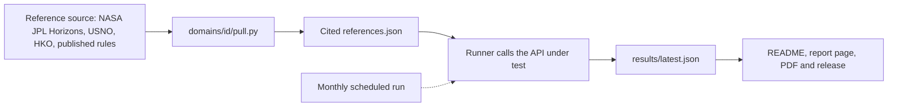

<p align="center">
  <a href="https://roxyapi.com">
    
  </a>
</p>

# Astrology API Accuracy Benchmark

The RoxyAPI Astrology API Accuracy Benchmark is an open, reproducible benchmark that checks the RoxyAPI astrology and insight API domain by domain against named authorities: NASA JPL Horizons for planets, angles and sidereal positions, and published calendar tables and definitions for calendars, time zones and rule based domains. Every reference value in the RoxyAPI benchmark is cited to its source, every pass band states its reason, and the MIT licensed runner points at any astrology API.

<!-- generated:claim:begin python -m benchmark readme, do not edit -->
> **For the Sun, Moon, planets and Chiron, RoxyAPI returned 231 of 231 positions within 0.32 arcsec (0.000089°) of NASA JPL Horizons.** In the open accuracy benchmark run of 2026-10-09, RoxyAPI returned 2,701 of 2,701 values within tolerance across 17 domains, with a median angular deviation of 0.048 arcsec (0.000013°).
>
> By unit: positions median 0.048 arcsec (0.000013°) over 661; instants median 1.6 seconds over 133; calendar counts median 0 days over 179; discrete values 1,728 of 1,728 exact. Target `roxyapi.com`, generated from [`results/latest.json`](results/latest.json).
<!-- generated:claim:end -->

<!-- generated:scorecard:begin python -m benchmark readme, do not edit -->
| Domain | Authority | Values | Within band | Median | p95 | Max | Unit |
|---|---|---:|---:|---:|---:|---:|---|
| [Western planets](#western-planets) | NASA JPL Horizons | 231 | 231 of 231 | 0.048 | 0.24 | 0.31 | arcsec |
| [Western angles and houses](#western-angles-and-houses) | NASA JPL Horizons sidereal time and obliquity, standard spherical astronomy | 200 | 200 of 200 | 0.12 | 0.62 | 1.5 | arcsec |
| [Vedic sidereal chart](#vedic-sidereal-chart) | NASA JPL Horizons with the Lahiri ayanamsa by its published definition | 230 | 230 of 230 | 0.039 | 0.23 | 1.5 | arcsec |
|  |  | 26 | 26 of 26 | 0.2 | 0.48 | 0.49 | days |
|  |  | 638 | 638 of 638 | 0 | 0 | 0 | exact |
| [Panchang](#panchang) | NASA JPL Horizons Sun and Moon longitudes by the classical definitions, sunrise from the US Naval Observatory | 13 | 13 of 13 | 0 | 0 | 0 | seconds |
|  |  | 60 | 60 of 60 | 0 | 0 | 0 | exact |
| [Forecast events](#forecast-events) | NASA JPL Horizons | 29 | 29 of 29 | 2.3 | 30.6 | 44.9 | seconds |
| [Moon phases](#moon-phases) | U.S. Naval Observatory primary moon phase tables, Universal Time dates | 11 | 11 of 11 | 0 | 0 | 0 | days |
| [Human Design bodygraph](#human-design-bodygraph) | NASA JPL Horizons with the 88 degree solar arc and the Rave Mandala | 10 | 10 of 10 | 0.014 | 0.27 | 0.27 | seconds |
|  |  | 90 | 90 of 90 | 0 | 0 | 0 | exact |
| [Chinese calendar](#chinese-calendar) | Hong Kong Observatory Gregorian-Lunar conversion tables, sexagenary cycle from a published anchor day | 103 | 103 of 103 | 0 | 0 | 0 | days |
|  |  | 32 | 32 of 32 | 0 | 0 | 0 | exact |
| [Feng shui](#feng-shui) | Printed Qing almanac and Xuan Kong rules recomputed, Hong Kong Observatory Li Chun dates | 13 | 13 of 13 | 0 | 0 | 0 | days |
|  |  | 243 | 243 of 243 | 0 | 0 | 0 | exact |
| [Mesoamerican calendar](#mesoamerican-calendar) | GMT correlation 584283, cross-checked against the FAMSI converter | 16 | 16 of 16 | 0 | 0 | 0 | days |
|  |  | 40 | 40 of 40 | 0 | 0 | 0 | exact |
| [Vastu](#vastu) | Brihat Samhita chapter 53 in the Iyer and Kern translations | 118 | 118 of 118 | 0 | 0 | 0 | exact |
| [Numerology](#numerology) | Pythagorean rules recomputed, cross-checked against published worked examples | 21 | 21 of 21 | 0 | 0 | 0 | exact |
| [Kabbalah](#kabbalah) | Published gematria letter table and the arithmetic Hebrew calendar | 72 | 72 of 72 | 0 | 0 | 0 | exact |
| [Biorhythm](#biorhythm) | Sine cycles of 23, 28 and 33 days, recomputed from the published definition | 10 | 10 of 10 | 0 | 0 | 0 | days |
|  |  | 60 | 60 of 60 | 0 | 0 | 0 | exact |
| [Ayurveda](#ayurveda) | NASA JPL Horizons Sun ingress by the classical season rule, sunrise from the US Naval Observatory | 81 | 81 of 81 | 1.7 | 25.1 | 29.5 | seconds |
|  |  | 24 | 24 of 24 | 0 | 0 | 0 | exact |
| [I Ching](#i-ching) | King Wen sequence, cross-checked against Legge and the Unicode Standard | 306 | 306 of 306 | 0 | 0 | 0 | exact |
| [Location](#location) | IANA Time Zone Database | 24 | 24 of 24 | 0 | 0 | 0 | exact |
<!-- generated:scorecard:end -->

[](https://roxyapi.github.io/astrology-api-benchmark/)

<!-- generated:coverage:begin python -m benchmark readme, do not edit -->
The RoxyAPI coverage map: each reference authority, the domain it checks and the quantities compared, generated from the references of every domain in the run.

```mermaid
flowchart LR
  d0("Western planets")
  a0["NASA JPL Horizons"]
  a1["NASA JPL Horizons small-body integration"]
  q0_0["Sun, Moon, planets and Chiron"]
  d1("Western angles and houses")
  a2["Spherical astronomy formulas"]
  q1_0["Ascendant, Midheaven and Placidus cusps"]
  d2("Vedic sidereal chart")
  a3["Lahiri ayanamsa, Calendar Reform Committee definition"]
  a4["IERS Conventions 2010, Table 5.3a"]
  a5["Positional Astronomy Centre, Kolkata"]
  a6["Brihat Parasara Hora Sastra"]
  q2_0["Lahiri ayanamsa and sidereal longitudes"]
  q2_1["Nakshatra and pada"]
  q2_2["Navamsa and Vimshottari"]
  d3("Panchang")
  a7["Surya Siddhanta, Burgess translation"]
  a8["US Naval Observatory Astronomical Applications API"]
  q3_0["Tithi, yoga, karana and vara"]
  q3_1["Sunrise"]
  d4("Forecast events")
  a9["US Naval Observatory seasons"]
  q4_0["Sign ingress instants"]
  q4_1["Station instants"]
  q4_2["Exact transit instant"]
  d5("Moon phases")
  a10["U.S. Naval Observatory Astronomical Applications moon phase service"]
  q5_0["Phase dates"]
  d6("Human Design bodygraph")
  a11["Introduction to the Human Design System"]
  a12["Jovian Archive"]
  a13["Human Design Gates by Zodiac Degrees"]
  q6_0["Design instant"]
  q6_1["Personality and design Sun and Earth gates and lines"]
  q6_2["Profile"]
  d7("Chinese calendar")
  a14["Hong Kong Observatory Gregorian-Lunar calendar conversion table"]
  a15["Sexagenary cycle"]
  a16["Ganzhi"]
  q7_0["Solar terms and Lunar New Year"]
  q7_1["Four pillars"]
  d8("Feng shui")
  a17["Xieji Bianfang Shu"]
  a18["Gujin Tushu Jicheng, Yangzhai Shishu"]
  a19["Shen Shi Xuan Kong Xue"]
  q8_0["Kua number and the Li Chun year boundary"]
  q8_1["Annual flying star plate"]
  q8_2["Natal period, mountain and water stars"]
  d9("Mesoamerican calendar")
  a20["GMT correlation definition"]
  a21["FAMSI date converter"]
  q9_0["Long Count and day count"]
  q9_1["Tzolkin sign and number"]
  q9_2["Haab month and day"]
  d10("Vastu")
  a22["Varahamihira, Brihat Samhita, translated by N. Chidambaram Iyer"]
  a23["Kern, Verspreide Geschriften vol. 2"]
  q10_0["Entrance side and pada from facing bearing and door position"]
  q10_1["Square of the nine by nine plan"]
  q10_2["Classical effect of the entrance pada"]
  d11("Numerology")
  a24["Pythagorean numerology rules"]
  a25["Hans Decoz worked examples"]
  q11_0["Life Path, Expression and Soul Urge"]
  d12("Kabbalah")
  a26["Mispar Hechrachi letter table"]
  a27["Dershowitz and Reingold, Calendrical Calculations"]
  a28["Hebcal date converter"]
  q12_0["Mispar Hechrachi and Mispar Gadol word values"]
  q12_1["Hebrew year, month and day, with the leap year flag"]
  d13("Biorhythm")
  a29["Cleve Moler, Biorhythms, MathWorks blog"]
  a30["US Patent 4,240,153, Biorhythm display device, USPTO"]
  q13_0["Physical, emotional and intellectual cycles"]
  d14("Ayurveda")
  a31["Sushruta Samhita, Bhishagratna translation"]
  a32["Charaka Samhita, Sutrasthana 6"]
  a33["Ashtanga Hridaya, Sutrasthana 1.8"]
  q14_0["Season at a date, both zodiacs and both hemispheres"]
  q14_1["Season opening and closing instants"]
  q14_2["Sunrise and sunset"]
  q14_3["Brahma muhurta window"]
  q14_4["Dosha periods of the day and night"]
  d15("I Ching")
  a34["List of hexagrams of the I Ching"]
  a35["The Unicode Standard, trigram and hexagram blocks"]
  a36["Legge, The Yi King, Sacred Books of the East vol. 16"]
  q15_0["King Wen hexagrams and trigrams"]
  d16("Location")
  a37["IANA Time Zone Database"]
  q16_0["Time zone and UTC offset"]
  a0 --> d0
  a1 --> d0
  d0 --> q0_0
  a0 --> d1
  a2 --> d1
  d1 --> q1_0
  a0 --> d2
  a3 --> d2
  a4 --> d2
  a5 --> d2
  a6 --> d2
  d2 --> q2_0
  d2 --> q2_1
  d2 --> q2_2
  a0 --> d3
  a7 --> d3
  a3 --> d3
  a5 --> d3
  a8 --> d3
  d3 --> q3_0
  d3 --> q3_1
  a0 --> d4
  a9 --> d4
  d4 --> q4_0
  d4 --> q4_1
  d4 --> q4_2
  a10 --> d5
  d5 --> q5_0
  a0 --> d6
  a11 --> d6
  a12 --> d6
  a13 --> d6
  d6 --> q6_0
  d6 --> q6_1
  d6 --> q6_2
  a14 --> d7
  a15 --> d7
  a16 --> d7
  d7 --> q7_0
  d7 --> q7_1
  a17 --> d8
  a18 --> d8
  a19 --> d8
  a14 --> d8
  d8 --> q8_0
  d8 --> q8_1
  d8 --> q8_2
  a20 --> d9
  a21 --> d9
  d9 --> q9_0
  d9 --> q9_1
  d9 --> q9_2
  a22 --> d10
  a23 --> d10
  d10 --> q10_0
  d10 --> q10_1
  d10 --> q10_2
  a24 --> d11
  a25 --> d11
  d11 --> q11_0
  a26 --> d12
  a27 --> d12
  a28 --> d12
  d12 --> q12_0
  d12 --> q12_1
  a29 --> d13
  a30 --> d13
  d13 --> q13_0
  a0 --> d14
  a31 --> d14
  a32 --> d14
  a7 --> d14
  a3 --> d14
  a5 --> d14
  a9 --> d14
  a33 --> d14
  a8 --> d14
  d14 --> q14_0
  d14 --> q14_1
  d14 --> q14_2
  d14 --> q14_3
  d14 --> q14_4
  a34 --> d15
  a35 --> d15
  a36 --> d15
  d15 --> q15_0
  a37 --> d16
  d16 --> q16_0
```


<!-- generated:coverage:end -->

**Latest RoxyAPI accuracy report:** [roxyapi.github.io/astrology-api-benchmark](https://roxyapi.github.io/astrology-api-benchmark/) ([PDF](https://roxyapi.github.io/astrology-api-benchmark/report.pdf), [JSON](results/latest.json), [CSV](results/latest.csv))

[](https://roxyapi.github.io/astrology-api-benchmark/)

## What does not count as an accuracy check

- **A wrapper checked against the library it wraps is a self-test.** It shows that arguments pass through, not that the numbers are right.
- **A wrapper checked against NASA JPL Horizons measures the library, not the vendor.** The agreement belongs to the library authors; the vendor added a network hop.
- **The widely used calculation libraries are licensed copyleft or sold under a commercial licence.** A buyer of an API built on one has to ask which licence applies to the product the buyer ships.
- **RoxyAPI reads the NASA JPL DE440 ephemeris directly, verified against NASA JPL Horizons.** No third party calculation library sits between the ephemeris and the response, so the comparison measures RoxyAPI work end to end.
- **A check that omits the bodies, dates or charts where its numbers look worse, or publishes only a median, hides its worst case.** This benchmark publishes every value it measures, Chiron and the 1879 chart included, with the maximum beside the median.
- **Planet positions are one slice of accuracy.** Angles and houses, sidereal frames, calendars, time zones and discrete rules each fail in their own way and need their own authority, so every domain here has its own folder, source and pass band.

## First published here

RoxyAPI published the open Astrology API Accuracy Benchmark first, in April 2026, as the commit history of the repository records. Other astrology API providers have since published accuracy checks of their own, and some have run the RoxyAPI benchmark against their own APIs. An open benchmark is built for exactly that: the method, the references and the runner are public, so anyone can check anyone.

## Getting started

You need a RoxyAPI key, from [roxyapi.com/pricing](https://roxyapi.com/pricing), and uv, which also installs the right Python.

**1. Install uv** ([official instructions](https://docs.astral.sh/uv/getting-started/installation/)).

macOS and Linux:

```bash
curl -LsSf https://astral.sh/uv/install.sh | sh
```

Windows (PowerShell):

```powershell
powershell -ExecutionPolicy ByPass -c "irm https://astral.sh/uv/install.ps1 | iex"
```

**2. Clone and install.**

```bash
git clone https://github.com/RoxyAPI/astrology-api-benchmark.git
cd astrology-api-benchmark
uv sync
```

**3. Add your key** to a file named `.env.local` in the repository root. It is gitignored.

```bash
ROXY_API_KEY=your_key_here
```

**4. Run every domain.** This writes `results/latest.json` and `results/latest.csv`, and exits nonzero when any value fails or is missing.

```bash
uv run python -m benchmark run
```

Add `--domain western-planets` (repeatable) to run one domain.

**5. Build the report page,** then open `dist/index.html` in a browser. It is one self contained file.

```bash
uv run python -m benchmark site
```

**6. Refresh this README** from the new results. The generated blocks are rewritten in place.

```bash
uv run python -m benchmark readme
```

## Run against another API

### One domain at a time

Many astrology APIs cover a single domain and list it as several products: a natal chart, synastry and daily horoscopes sold as three. The RoxyAPI benchmark counts the way the RoxyAPI API reference does, one domain per distinct body of calculation, so those three are one domain here (Western astrology, checked by the Western planets and Western angles folders), and every domain in the coverage map above is a separate one. To test a single-domain provider, run only the folder that matches what it sells:

```bash
uv run python -m benchmark run --domain western-planets
uv run python -m benchmark run --domain western-planets --domain western-angles
```

`--domain` takes a folder name under `domains/` and repeats; without it every domain runs.

### Against another base URL

1. Set that provider key as `ROXY_API_KEY` in `.env.local`; the runner sends it in the `X-API-Key` header. A provider that expects another header needs one line changed in `benchmark/api.py`.
2. Adapt the `check()` function in `domains/{id}/check.py` for each domain you run. It is the one place a response is read, mapping it to the quantity names in `references.json`.
3. Run that domain against the provider and keep its results apart:

```bash
uv run python -m benchmark run --target https://api.example.com/v1 --domain western-planets --out runs/example
```

The references, pass bands and statistics stay exactly as they are, so a single-domain provider is measured by the same numbers as the full RoxyAPI run.

## Method



The runner reads committed references only. The scheduled workflow reruns it every month, rewrites the results and republishes the README, the report page, the PDF and the release.

**Time.** The API receives the local birth time with its UTC offset or IANA zone name, exactly as a user would send it. The reference is computed at the UT instant from standard datetime math. A wrong time zone resolution moves every position, and the Moon, at about 13 degrees a day, shows it first.

**Reference.** Each domain names its authority and commits its reference values with the source, the retrieval date and the licence. Machine sources such as NASA JPL Horizons are pulled by `domains/{id}/pull.py`. Rule based domains are recomputed from a published definition, and a second source is transcribed as cross checks the recomputation must reproduce. The runner reads committed files only and never contacts a reference server.

**A check.** For every case the runner calls the API, reads each quantity and measures the deviation in the unit of that quantity: arcseconds for angles with 0 to 360 wraparound, seconds for instants, days for calendar counts, exact match for discrete values. A value inside its pass band is PASS, outside is FAIL, absent or unreadable is MISSING. Pass bands are vendor neutral floors, never sized to one implementation, so read the largest deviation per quantity for regressions.

**Two choices on the planets.** Jupiter to Pluto are compared with the Horizons system barycentres, which is what a planetary ephemeris integrates, because the Horizons planet centres come from separate satellite solutions that sit thousands of kilometres off it. The residual left on the oldest chart, from 1879, is the reference frame model: Horizons prints longitudes on the IAU 1976 and 1980 precession and nutation model, which drifts from the current IAU 2006 and 2000 model by about 0.3 arcseconds per century away from the year 2000.

**Subjects.** The shared subject corpus is `data/charts.csv`. Named charts carry an AA, A or B Rodden rating from the public [Astro-Databank](https://www.astro.com/astro-databank) record, so anyone can check the birth data. Synthetic charts exercise time zone edge cases on purpose: daylight saving gaps and overlaps, local mean time before standard zones, half hour offsets, high latitudes and a skipped calendar day. Their value is coverage, not provenance.

## Domains

<!-- generated:domains:begin python -m benchmark readme, do not edit -->
### Western planets

**Authority:** NASA JPL Horizons. **Covers:** Sun, Moon, planets and Chiron. **Endpoints:** [`POST /api/v2/astrology/natal-chart`](https://roxyapi.com/api-reference#tag/western-astrology/POST/astrology/natal-chart).

**Quantities and pass bands**

| Quantities | Pass band | Why |
|---|---|---|
| Moon | 72 arcsec | The Moon moves about 13 degrees a day, so this absorbs a couple of minutes of birth time interpretation. A vendor-neutral pass bar, not sized to any one API. |
| Sun, Mercury, Venus, Mars, Jupiter, Saturn, Uranus, Neptune, Pluto, Chiron | 36 arcsec | A vendor-neutral pass bar, not sized to any one API. Wide enough for the legitimate arcsecond level disagreement between two good ephemeris implementations, tight enough to fail a geometric rather than an apparent ephemeris, a wrong timezone resolution or a wrong epoch element set. Read the per body maxima for regressions: a body drifting from 0.1 to 20 arcseconds still passes. |

**How the reference is obtained**

- [NASA JPL Horizons](https://ssd.jpl.nasa.gov/api/horizons.api): Apparent geocentric ecliptic longitude of date at the chart instant converted to UT, read from the Observer Ecliptic Longitude column, seven decimal degrees as printed. Sun to Mars use their own Horizons centres. Jupiter to Pluto use the Horizons system barycentres 5 to 9: the planetary ephemeris integrates the system barycentres, while the planet centres come from separate satellite solutions that sit off it by thousands of kilometres. Regenerated by `python -m benchmark pull western-planets` (OBSERVER table, CENTER 500@399, QUANTITIES 31, one minute step).
- [NASA JPL Horizons small-body integration](https://ssd.jpl.nasa.gov/api/horizons.api): Apparent geocentric ecliptic longitude of the small body 2060 Chiron at the chart instant converted to UT, which Horizons integrates on demand from the initial conditions of its orbit solution, read from the same column as the planets. Regenerated by `python -m benchmark pull western-planets` (OBSERVER table, CENTER 500@399, QUANTITIES 31, one minute step).

**Sample checks from the run**

| Case | Subject | Quantity | Reference | API | Deviation | Result |
|---|---|---|---|---|---:|---|
| `einstein` | Albert Einstein, 1879-03-14 11:30 | Pluto | 54.7254767 | 54.7255640 | 0.31 arcsec | PASS |
| `obama` | Barack Obama, 1961-08-04 19:24 | Sun | 132.5479089 | 132.5479205 | 0.042 arcsec | PASS |
| `beyonce` | Beyonce Knowles, 1981-09-04 21:47 | Sun | 162.4555603 | 162.4555734 | 0.047 arcsec | PASS |
| `diana` | Princess Diana, 1961-07-01 19:45 | Sun | 99.6630446 | 99.6630575 | 0.046 arcsec | PASS |
| `jobs` | Steve Jobs, 1955-02-24 19:15 | Sun | 335.7481040 | 335.7481271 | 0.083 arcsec | PASS |

**Per quantity**

| Quantity | Reference | Median | Max | Worst case |
|---|---|---:|---:|---|
| Pluto | NASA JPL Horizons | 0.056 arcsec | 0.32 arcsec | `einstein` |
| Saturn | NASA JPL Horizons | 0.049 arcsec | 0.31 arcsec | `einstein` |
| Neptune | NASA JPL Horizons | 0.048 arcsec | 0.31 arcsec | `einstein` |
| Chiron | NASA JPL Horizons small-body integration | 0.049 arcsec | 0.31 arcsec | `einstein` |
| Uranus | NASA JPL Horizons | 0.048 arcsec | 0.31 arcsec | `einstein` |
| Jupiter | NASA JPL Horizons | 0.048 arcsec | 0.31 arcsec | `einstein` |
| Mars | NASA JPL Horizons | 0.048 arcsec | 0.31 arcsec | `einstein` |
| Sun | NASA JPL Horizons | 0.048 arcsec | 0.31 arcsec | `einstein` |
| Venus | NASA JPL Horizons | 0.048 arcsec | 0.31 arcsec | `einstein` |
| Mercury | NASA JPL Horizons | 0.048 arcsec | 0.3 arcsec | `einstein` |
| Moon | NASA JPL Horizons | 0.048 arcsec | 0.27 arcsec | `einstein` |

### Western angles and houses

**Authority:** NASA JPL Horizons sidereal time and obliquity, standard spherical astronomy. **Covers:** Ascendant, Midheaven and Placidus cusps. **Endpoints:** [`POST /api/v2/astrology/natal-chart`](https://roxyapi.com/api-reference#tag/western-astrology/POST/astrology/natal-chart).

**Quantities and pass bands**

| Quantities | Pass band | Why |
|---|---|---|
| Ascendant, Midheaven, Cusp 2, Cusp 3, Cusp 5, Cusp 6, Cusp 8, Cusp 9, Cusp 11, Cusp 12 | 36 arcsec | A vendor-neutral pass bar, not sized to any one API, the same as the planets. The sky turns 15 arcseconds per second of time, so the bar admits two good implementations that differ by milliarcseconds in their precession and nutation model, or by the under one second between UTC and UT1, and fails a wrong timezone resolution, mean in place of true obliquity at high latitude, a sign or quadrant slip, or a different house system. Angles and cusps magnify a time error at high latitude, so read the per quantity maxima for regressions. |

**How the reference is obtained**

- [NASA JPL Horizons](https://ssd.jpl.nasa.gov/api/horizons.api): Local apparent sidereal time at the birthplace at the chart instant converted to UT, and the true obliquity of date solved from the apparent equatorial and ecliptic coordinates of one direction. Horizons converts UTC to UT1 with its Earth orientation table before computing sidereal time; before 1962 it reads the time as UT1. Frame IAU 1976/1980 as Horizons prints it. Charts at or beyond the polar circles are skipped because Placidus is undefined there: tromso_midnight_sun. Regenerated by `python -m benchmark pull western-angles` (OBSERVER tables: QUANTITIES 7 at the birthplace; QUANTITIES 2 and 31 of geocentric bodies).
- Spherical astronomy formulas: Midheaven: the ecliptic longitude whose right ascension is the sidereal angle. Ascendant: the rising ecliptic point on the horizon. Placidus cusps 11 and 12: the ecliptic points one and two thirds of their own diurnal semi arc east of the meridian; cusps 2 and 3: two and one thirds of their own nocturnal semi arc west of the lower meridian, each by fixed point iteration to 1e-10 degrees; cusps 5, 6, 8 and 9 are their opposites. Seven decimal degrees. Cited: Jean Meeus, Astronomical Algorithms, first edition, Willmann-Bell, 1991: chapter 12 eq. 12.1 to 12.4 and 12.9, chapter 14 eq. 14.1. Placidus de Titis, Tabulae Primi Mobilis, 1657, for the house definition.. Regenerated by `python -m benchmark pull western-angles`.

**Sample checks from the run**

| Case | Subject | Quantity | Reference | API | Deviation | Result |
|---|---|---|---|---|---:|---|
| `anchorage_winter` | Anchorage winter solstice, 1985-12-21 12:00 | Ascendant | 303.1606897 | 303.1611039 | 1.5 arcsec | PASS |
| `obama` | Barack Obama, 1961-08-04 19:24 | Ascendant | 318.0445697 | 318.0446194 | 0.18 arcsec | PASS |
| `beyonce` | Beyonce Knowles, 1981-09-04 21:47 | Ascendant | 29.0117746 | 29.0117923 | 0.064 arcsec | PASS |
| `diana` | Princess Diana, 1961-07-01 19:45 | Ascendant | 258.4085810 | 258.4085350 | 0.17 arcsec | PASS |
| `einstein` | Albert Einstein, 1879-03-14 11:30 | Ascendant | 101.6464077 | 101.6464050 | 0.0098 arcsec | PASS |

**Per quantity**

| Quantity | Reference | Median | Max | Worst case |
|---|---|---:|---:|---|
| Ascendant | NASA JPL Horizons sidereal time and obliquity, standard spherical astronomy | 0.1 arcsec | 1.5 arcsec | `anchorage_winter` |
| Cusp 8 | NASA JPL Horizons sidereal time and obliquity, standard spherical astronomy | 0.11 arcsec | 1.1 arcsec | `anchorage_winter` |
| Cusp 2 | NASA JPL Horizons sidereal time and obliquity, standard spherical astronomy | 0.11 arcsec | 1.1 arcsec | `anchorage_winter` |
| Midheaven | NASA JPL Horizons sidereal time and obliquity, standard spherical astronomy | 0.12 arcsec | 0.86 arcsec | `reykjavik_summer` |
| Cusp 5 | NASA JPL Horizons sidereal time and obliquity, standard spherical astronomy | 0.12 arcsec | 0.74 arcsec | `reykjavik_summer` |
| Cusp 11 | NASA JPL Horizons sidereal time and obliquity, standard spherical astronomy | 0.12 arcsec | 0.74 arcsec | `reykjavik_summer` |
| Cusp 9 | NASA JPL Horizons sidereal time and obliquity, standard spherical astronomy | 0.11 arcsec | 0.73 arcsec | `reykjavik_summer` |
| Cusp 3 | NASA JPL Horizons sidereal time and obliquity, standard spherical astronomy | 0.11 arcsec | 0.73 arcsec | `reykjavik_summer` |
| Cusp 12 | NASA JPL Horizons sidereal time and obliquity, standard spherical astronomy | 0.12 arcsec | 0.69 arcsec | `anchorage_winter` |
| Cusp 6 | NASA JPL Horizons sidereal time and obliquity, standard spherical astronomy | 0.12 arcsec | 0.69 arcsec | `anchorage_winter` |

### Vedic sidereal chart

**Authority:** NASA JPL Horizons with the Lahiri ayanamsa by its published definition. **Covers:** Lahiri ayanamsa and sidereal longitudes; Nakshatra and pada; Navamsa and Vimshottari. **Endpoints:** [`POST /api/v2/vedic-astrology/birth-chart`](https://roxyapi.com/api-reference#tag/vedic-astrology/POST/vedic-astrology/birth-chart), [`POST /api/v2/vedic-astrology/navamsa`](https://roxyapi.com/api-reference#tag/vedic-astrology/POST/vedic-astrology/navamsa), [`POST /api/v2/vedic-astrology/dasha/major`](https://roxyapi.com/api-reference#tag/vedic-astrology/POST/vedic-astrology/dasha/major).

**Quantities and pass bands**

| Quantities | Pass band | Why |
|---|---|---|
| Moon | 72 arcsec | The Moon moves about 13 degrees a day, so this absorbs a couple of minutes of birth time interpretation. A vendor-neutral pass bar, as for the tropical Moon. |
| Sun, Mars, Mercury, Jupiter, Venus, Saturn | 36 arcsec | The tropical planet bar: wide enough for the arcsecond level disagreement between two good ephemeris implementations, tight enough to fail a geometric position or a wrong timezone. The frame is held separately by the ayanamsa bar. |
| Lagna | 36 arcsec | The Ascendant turns a degree in about four minutes, so this is a couple of seconds of sidereal time: room for the UT1 handling of two good implementations, tight enough to fail sidereal time from UTC alone, a mean sidereal time or a wrong timezone. |
| ayanamsa | 3 arcsec | Two faithful implementations of this definition differ by the precession model (under an arcsecond between the 1955 rate and the IAU rate over 1879 to 2026) and the epoch rounding (0.658 arcseconds). A frame without the nutation term, up to 18 arcseconds off, or a different Lahiri revision fails. |
| dasha balance | 1 day | A balance is commonly printed in whole days, and a year of 365.2422 days instead of 365.25 moves a 20 year balance by under a quarter of a day. One day is also about 7 arcseconds of the Moon on a Venus balance, so the bar keeps the frame honest. |
| Sun nakshatra, Sun pada, Sun navamsa, Moon nakshatra, Moon pada, Moon navamsa, Mars nakshatra, Mars pada, Mars navamsa, Mercury nakshatra, Mercury pada, Mercury navamsa, Jupiter nakshatra, Jupiter pada, Jupiter navamsa, Venus nakshatra, Venus pada, Venus navamsa, Saturn nakshatra, Saturn pada, Saturn navamsa, Lagna nakshatra, Lagna pada, Lagna navamsa, dasha lord | exact match | Nakshatra, pada, navamsa sign and dasha lord are discrete: a value is the definition applied to the sidereal longitude or it is not. |

**How the reference is obtained**

- [NASA JPL Horizons](https://ssd.jpl.nasa.gov/api/horizons.api): Apparent geocentric ecliptic longitude of date at the case instant, minus the Lahiri ayanamsa recomputed from its definition at the same instant. Sun to Mars by their own centres, Jupiter and Saturn by the system barycentres. The Lagna is the rising ecliptic point from the local apparent sidereal time at the birthplace and the true obliquity of date solved from the same graha rows (Jean Meeus, Astronomical Algorithms, first edition, 1991, eq. 12.1, 12.2 and 12.9), omitted beyond the polar circles and at instants off the minute. Regenerated by `python -m benchmark pull vedic` (OBSERVER tables: QUANTITIES 2, 30 and 31 of geocentric bodies; QUANTITIES 7 at the birthplace).
- [Lahiri ayanamsa, Calendar Reform Committee definition](https://archive.org/details/calendar_reform_comittee_report): 23 deg 15 min on 21 March 1956, growing with the general precession in longitude. Held at 23 deg 15 min 00.658 sec at 0h TT as a true ayanamsa, the reading that reproduces the Positional Astronomy Centre tables, carried by IERS Conventions 2010 equation 5.44 and the IAU 2000A nutation in longitude. Cited: Report of the Calendar Reform Committee, Government of India, Council of Scientific and Industrial Research, 1955: Recommendations for the religious calendar, item 7, pages 7 and 8; general precession, page 209.
- [IERS Conventions 2010, Table 5.3a](https://iers-conventions.obspm.fr/content/chapter5/additional_info/tab5.3a.txt): IAU 2000A nutation in longitude, all lunisolar and planetary terms, with the fundamental arguments of equations 5.43 and 5.44. Regenerated by `python -m benchmark pull vedic` (downloads the table on each pull).
- [Positional Astronomy Centre, Kolkata](https://packolkata.imd.gov.in/download/nirlon/nlongitude.htm): Published nirayana longitudes of the Sun, Moon and planets at 0h TT, transcribed for three dates as cross checks the recomputation reproduces. 3 subjects transcribed from this source are reproduced by the recomputation in the test suite.
- [Brihat Parasara Hora Sastra](https://archive.org/details/BPHSEnglish): Nakshatra and pada from the sidereal longitude in spans of 13 deg 20 min and 3 deg 20 min, navamsa from the movable, fixed and dual sign rule, dasha lord counted from Krittika, balance as the unexpired fraction of the Moon nakshatra times the lord years in Julian years of 365.25 days. Cited: Brihat Parasara Hora Sastra, translated by R. Santhanam, Ranjan Publications: chapter 6 sloka 12 (volume 1 page 72) for navamsa, chapter 46 slokas 12 to 16 and notes (volume 2 pages 507 to 509) for nakshatra, pada and the Vimshottari dasha at birth.

**Sample checks from the run**

| Case | Subject | Quantity | Reference | API | Deviation | Result |
|---|---|---|---|---|---:|---|
| `anchorage_winter` | Anchorage winter solstice, 1985-12-21 12:00 | Lagna | 279.5023827 | 279.5027944 | 1.5 arcsec | PASS |
| `jfk` | John F Kennedy, 1917-05-29 15:00 | dasha balance | `1186.486` | `1186` | 0.49 days | PASS |
| `obama` | Barack Obama, 1961-08-04 19:24 | Jupiter nakshatra | `21` | `21` | 0 exact | PASS |
| `beyonce` | Beyonce Knowles, 1981-09-04 21:47 | ayanamsa | 23.5970361 | 23.5970385 | 0.0086 arcsec | PASS |
| `diana` | Princess Diana, 1961-07-01 19:45 | ayanamsa | 23.3170077 | 23.3170101 | 0.0086 arcsec | PASS |

**Per quantity**

| Quantity | Reference | Median | Max | Worst case |
|---|---|---:|---:|---|
| Lagna | NASA JPL Horizons with the Lahiri ayanamsa by its published definition | 0.084 arcsec | 1.5 arcsec | `anchorage_winter` |
| Saturn | NASA JPL Horizons with the Lahiri ayanamsa by its published definition | 0.04 arcsec | 0.3 arcsec | `einstein` |
| Jupiter | NASA JPL Horizons with the Lahiri ayanamsa by its published definition | 0.039 arcsec | 0.3 arcsec | `einstein` |
| Mars | NASA JPL Horizons with the Lahiri ayanamsa by its published definition | 0.039 arcsec | 0.3 arcsec | `einstein` |
| Sun | NASA JPL Horizons with the Lahiri ayanamsa by its published definition | 0.039 arcsec | 0.3 arcsec | `einstein` |
| Venus | NASA JPL Horizons with the Lahiri ayanamsa by its published definition | 0.04 arcsec | 0.3 arcsec | `einstein` |
| Mercury | NASA JPL Horizons with the Lahiri ayanamsa by its published definition | 0.039 arcsec | 0.29 arcsec | `einstein` |
| Moon | NASA JPL Horizons with the Lahiri ayanamsa by its published definition | 0.04 arcsec | 0.26 arcsec | `einstein` |
| ayanamsa | NASA JPL Horizons with the Lahiri ayanamsa by its published definition | 0.0087 arcsec | 0.0096 arcsec | `greenwich_y2k` |

### Panchang

**Authority:** NASA JPL Horizons Sun and Moon longitudes by the classical definitions, sunrise from the US Naval Observatory. **Covers:** Tithi, yoga, karana and vara; Sunrise. **Endpoints:** [`POST /api/v2/vedic-astrology/panchang/basic`](https://roxyapi.com/api-reference#tag/vedic-astrology/POST/vedic-astrology/panchang/basic), [`POST /api/v2/vedic-astrology/panchang/detailed`](https://roxyapi.com/api-reference#tag/vedic-astrology/POST/vedic-astrology/panchang/detailed).

**Quantities and pass bands**

| Quantities | Pass band | Why |
|---|---|---|
| sunrise | 90 seconds | The reference prints whole minutes and so does a typical response, so two exact values can differ by up to a minute through rounding alone; the half minute beyond covers the difference between two good ephemeris implementations of the same upper limb and 34 arcminute definition. A different limb (about 4 minutes at mid latitudes) or no refraction (about 2 to 3) fails. |
| tithi, yoga, karana, vara | exact match | Tithi, yoga, karana and vara are discrete: a value is the definition applied to the Sun and Moon longitudes, or the weekday of the sunrise date, or it is not. |

**How the reference is obtained**

- [NASA JPL Horizons](https://ssd.jpl.nasa.gov/api/horizons.api): Apparent geocentric ecliptic longitude of date of the Sun and Moon at the case instant. Elongation for tithi and karana, sidereal sum for yoga. Regenerated by `python -m benchmark pull panchang` (OBSERVER tables: QUANTITIES 30 and 31 of the geocentric Sun and Moon).
- [Surya Siddhanta, Burgess translation](https://archive.org/details/jstor-592174): Tithi is the elongation in units of 12 degrees, karana in units of 6 degrees, yoga the sidereal sum in units of 13 degrees 20 minutes, vara the weekday of the civil date whose sunrise opens the day. Cited: Translation of the Surya-Siddhanta, a Text-Book of Hindu Astronomy, by Ebenezer Burgess, Journal of the American Oriental Society, volume 6, 1860: chapter 2 verses 65 to 69 (pages 235 to 238) for yoga, tithi and karana; chapter 1 verse 13 note (page 151) and verses 51 and 52 (pages 175 and 176) for the day counted from sunrise and named for its lord.
- [Lahiri ayanamsa, Calendar Reform Committee definition](https://archive.org/details/calendar_reform_comittee_report): 23 deg 15 min on 21 March 1956, growing with the general precession in longitude. Held at 23 deg 15 min 00.658 sec at 0h TT as a true ayanamsa, carried by IERS Conventions 2010 equation 5.44 and the IAU 2000A nutation in longitude (Table 5.3a, downloaded on each pull). Enters yoga only. Cited: Report of the Calendar Reform Committee, Government of India, Council of Scientific and Industrial Research, 1955: Recommendations for the religious calendar, item 7, pages 7 and 8; general precession, page 209.
- [Positional Astronomy Centre, Kolkata](https://packolkata.imd.gov.in/download/nirlon/nlongitude.htm): Published nirayana longitudes of the Sun and Moon at 0h TT, transcribed for three dates as cross checks: the limbs they give must equal the recomputed ones. 3 subjects transcribed from this source are reproduced by the recomputation in the test suite.
- [US Naval Observatory Astronomical Applications API](https://aa.usno.navy.mil/data/api): The Rise entry of the Sun data, in the local zone given. Sunrise is the upper limb of the Sun on a level sea horizon under 34 arcminutes of refraction. The service prints whole minutes. Cited: Complete Sun and Moon Data for One Day; rise and set defined at https://aa.usno.navy.mil/faq/RST_defs. Regenerated by `python -m benchmark pull panchang` (GET rstt/oneday with date, coords and tz in hours).

**Sample checks from the run**

| Case | Subject | Quantity | Reference | API | Deviation | Result |
|---|---|---|---|---|---:|---|
| `mumbai-noon` | `{"date": "2026-03-08", "time": "12:00:00", "latitude": 19.076, "longitude": 72.8777, "timezone": 5.5}` | sunrise | `2026-03-08T06:53:00+05:30` | `2026-03-08T06:53:00+05:30` | 0 seconds | PASS |
| `mumbai-noon` | `{"date": "2026-03-08", "time": "12:00:00", "latitude": 19.076, "longitude": 72.8777, "timezone": 5.5}` | karana | `4` | `4` | 0 exact | PASS |
| `new-york-evening` | `{"date": "2026-11-01", "time": "19:30:00", "latitude": 40.7128, "longitude": -74.006, "timezone": -5}` | tithi | `23` | `23` | 0 exact | PASS |
| `sydney-morning` | `{"date": "2026-01-15", "time": "08:15:00", "latitude": -33.8688, "longitude": 151.2093, "timezone": 11}` | tithi | `27` | `27` | 0 exact | PASS |
| `honolulu-night` | `{"date": "2026-08-02", "time": "23:40:00", "latitude": 21.3099, "longitude": -157.8581, "timezone": -10}` | tithi | `20` | `20` | 0 exact | PASS |

**Per quantity**

| Quantity | Reference | Median | Max | Worst case |
|---|---|---:|---:|---|
| sunrise | US Naval Observatory Astronomical Applications API | 0 seconds | 0 seconds | `mumbai-noon` |

### Forecast events

**Authority:** NASA JPL Horizons. **Covers:** Sign ingress instants; Station instants; Exact transit instant. **Endpoints:** [`POST /api/v2/forecast/transits`](https://roxyapi.com/api-reference#tag/forecast/POST/forecast/transits), [`POST /api/v2/astrology/transits/monthly`](https://roxyapi.com/api-reference#tag/western-astrology/POST/astrology/transits/monthly).

**Quantities and pass bands**

| Quantities | Pass band | Why |
|---|---|---|
| Sun ingress, Sun ingress, monthly table, Mercury ingress, Mercury ingress, monthly table, Venus ingress, Venus ingress, monthly table, Mars ingress, Mars ingress, monthly table, Sun transit | 60 seconds | A vendor-neutral pass bar, not sized to any one API. At these events the Sun, Mercury, Venus and Mars move at least half a degree a day, so a minute is at least an arcsecond of motion: wide enough for the arcsecond level disagreement between two good ephemerides, tight enough to fail a crossing read off a sampled table or a longitude in the wrong frame. The monthly table prints whole minutes, which takes up to half of this band. An exact transit also carries the natal longitude, so a natal error shows here as time. |
| Moon ingress, monthly table | 60 seconds | The Moon moves about 13 degrees a day, so a minute is about 33 arcseconds, inside the band its position is held to. The table prints whole minutes, which takes up to half of this band. |
| Jupiter ingress, Jupiter ingress, monthly table, Uranus ingress, Uranus ingress, monthly table, Neptune ingress, Neptune ingress, monthly table | 600 seconds | Jupiter to Pluto move between a few hundredths and a quarter of a degree a day, so the same arcsecond of legitimate disagreement is tens of seconds to over ten minutes of time. Ten minutes is under one arcsecond of Neptune motion and still fails a crossing read off an hourly or daily table. |
| Mars station, Venus station, Mercury station | 60 seconds | A station is the instant the longitude rate is zero, the vertex of a near parabola, so its time is set by the rate, not the position: within a minute of a Mars station the longitude changes by a hundred thousandth of an arcsecond. Mercury, Venus and Mars turn fast enough that a minute is a rate disagreement of 0.03 arcseconds a day for Mars to 0.35 for Mercury, which two good ephemerides stay inside. |
| Pluto station, Neptune station, Saturn station | 600 seconds | Saturn to Pluto turn so slowly, their rate changing by 0.0005 to 0.002 degrees a day each day, that a rate disagreement of a thousandth of an arcsecond a day moves the station by up to a minute, so the band is wider than for the fast bodies. Ten minutes still fails a station taken from a sampled table, and a longitude without the precession of date, which moves a Pluto station by about two hours. |

**How the reference is obtained**

- [NASA JPL Horizons](https://ssd.jpl.nasa.gov/api/horizons.api): Apparent geocentric ecliptic longitude of date, tabulated daily over the month of the event to bracket it and hourly around the bracket to locate it. An ingress or an exact transit is the instant the longitude reaches the sign boundary or the natal point plus the aspect angle, by bisection on the cubic through the four hourly rows around the crossing. A station is the instant the longitude rate is zero, by bisection on the derivative of a degree six least squares polynomial fitted to four days of rows ten minutes apart. Interpolation follows Meeus, Astronomical Algorithms, 2nd edition, chapter 3. Times are UT, kept to the millisecond the search resolves; the seven printed decimals bound them well under a second. Every event is in the past, where Horizons applies measured delta T. The natal point of the exact transit is the Horizons longitude at the birth instant of the chart. Sun to Mars use their own Horizons centres, Jupiter to Pluto the system barycentres, as for the planets. Regenerated by `python -m benchmark pull forecast` (OBSERVER table, CENTER 500@399, QUANTITIES 31, daily then hourly or ten minute step, root by bisection).
- [US Naval Observatory seasons](https://aa.usno.navy.mil/data/api): Equinox and solstice instants in UT to the minute as published. The Sun entering Aries and Cancer is the same event, so the two values are kept as cross checks of the Horizons recomputation, not as references. Regenerated by `python -m benchmark pull forecast` (GET /api/seasons?year=YYYY). 2 subjects transcribed from this source are reproduced by the recomputation in the test suite.

**Sample checks from the run**

| Case | Subject | Quantity | Reference | API | Deviation | Result |
|---|---|---|---|---|---:|---|
| `uranus-enters-gemini-2025-07` | `{}` | Uranus ingress, monthly table | `2025-07-07T07:47:44.895+00:00` | `2025-07-07T07:47:00+00:00` | 44.9 seconds | PASS |
| `sun-enters-aries-2025-03` | `{}` | Sun ingress | `2025-03-20T09:01:30.060+00:00` | `2025-03-20T09:01:29Z` | 1.1 seconds | PASS |
| `sun-enters-cancer-2025-06` | `{}` | Sun ingress | `2025-06-21T02:42:16.842+00:00` | `2025-06-21T02:42:16Z` | 0.84 seconds | PASS |
| `mercury-enters-aries-2025-03` | `{}` | Mercury ingress | `2025-03-03T09:03:40.471+00:00` | `2025-03-03T09:03:40Z` | 0.47 seconds | PASS |
| `mercury-reenters-pisces-2025-03` | `{}` | Mercury ingress | `2025-03-30T02:17:57.917+00:00` | `2025-03-30T02:17:59Z` | 1.1 seconds | PASS |

**Per quantity**

| Quantity | Reference | Median | Max | Worst case |
|---|---|---:|---:|---|
| Uranus ingress, monthly table | NASA JPL Horizons | 44.9 seconds | 44.9 seconds | `uranus-enters-gemini-2025-07` |
| Neptune ingress | NASA JPL Horizons | 30.6 seconds | 30.7 seconds | `neptune-enters-aries-2025-03` |
| Sun ingress, monthly table | NASA JPL Horizons | 23.5 seconds | 30.1 seconds | `sun-enters-aries-2025-03` |
| Venus ingress, monthly table | NASA JPL Horizons | 27.9 seconds | 28 seconds | `venus-reenters-pisces-2025-03` |
| Neptune ingress, monthly table | NASA JPL Horizons | 26.6 seconds | 26.7 seconds | `neptune-enters-aries-2025-03` |
| Uranus ingress | NASA JPL Horizons | 25.9 seconds | 25.9 seconds | `uranus-enters-gemini-2025-07` |
| Moon ingress, monthly table | NASA JPL Horizons | 20 seconds | 20.2 seconds | `moon-enters-capricorn-2025-03` |
| Mercury ingress, monthly table | NASA JPL Horizons | 10.8 seconds | 19.6 seconds | `mercury-enters-aries-2025-03` |
| Jupiter ingress, monthly table | NASA JPL Horizons | 15.4 seconds | 15.5 seconds | `jupiter-enters-cancer-2025-06` |
| Pluto station | NASA JPL Horizons | 13.8 seconds | 13.8 seconds | `pluto-stations-retrograde-2025-05` |
| Mars ingress, monthly table | NASA JPL Horizons | 7.7 seconds | 7.8 seconds | `mars-enters-leo-2025-04` |
| Jupiter ingress | NASA JPL Horizons | 5.4 seconds | 5.5 seconds | `jupiter-enters-cancer-2025-06` |
| Mars ingress | NASA JPL Horizons | 2.3 seconds | 2.3 seconds | `mars-enters-leo-2025-04` |
| Venus ingress | NASA JPL Horizons | 1.9 seconds | 2 seconds | `venus-reenters-pisces-2025-03` |
| Mercury ingress | NASA JPL Horizons | 0.78 seconds | 1.1 seconds | `mercury-reenters-pisces-2025-03` |
| Sun ingress | NASA JPL Horizons | 0.95 seconds | 1.1 seconds | `sun-enters-aries-2025-03` |
| Mars station | NASA JPL Horizons | 0.83 seconds | 0.84 seconds | `mars-stations-direct-2025-02` |
| Saturn station | NASA JPL Horizons | 0.72 seconds | 0.72 seconds | `saturn-stations-retrograde-2025-07` |
| Venus station | NASA JPL Horizons | 0.35 seconds | 0.67 seconds | `venus-stations-direct-2025-04` |
| Neptune station | NASA JPL Horizons | 0.62 seconds | 0.62 seconds | `neptune-stations-retrograde-2025-07` |
| Mercury station | NASA JPL Horizons | 0.19 seconds | 0.26 seconds | `mercury-stations-direct-2025-04` |
| Sun transit | NASA JPL Horizons | 0.021 seconds | 0.021 seconds | `sun-opposes-natal-pluto-2025-02` |

### Moon phases

**Authority:** U.S. Naval Observatory primary moon phase tables, Universal Time dates. **Covers:** Phase dates. **Endpoints:** [`GET /api/v2/astrology/moon-phase/upcoming`](https://roxyapi.com/api-reference#tag/western-astrology/GET/astrology/moon-phase/upcoming).

**Quantities and pass bands**

| Quantities | Pass band | Why |
|---|---|---|
| date | 0 days | A phase date is a calendar day. Away from midnight a one day miss is a wrong phase; within an hour of midnight it is a wrong time zone. |

**How the reference is obtained**

- [U.S. Naval Observatory Astronomical Applications moon phase service](https://aa.usno.navy.mil/data/api): The primary phases of each listed year are read from the year endpoint: the phase name and the instant in Universal Time. The expected value is the calendar date of that instant in Universal Time. The API under test names no time zone for this list and carries no parameter for one, so its dates are compared as Universal Time dates, the zone its sibling phase endpoint documents as its default. Two cases sit within an hour of midnight Universal Time, one on each side, to prove that convention; the others sit at least three hours from it. Regenerated by `python -m benchmark pull moon-phases` (one JSON document per year).

**Sample checks from the run**

| Case | Subject | Quantity | Reference | API | Deviation | Result |
|---|---|---|---|---|---:|---|
| `new-1969-07-14` | `{"startDate": "1969-07-11", "count": 2, "phase": "New Moon"}` | date | `1969-07-14` | `1969-07-14` | 0 days | PASS |
| `first-1969-07-22` | `{"startDate": "1969-07-19", "count": 2, "phase": "First Quarter Moon"}` | date | `1969-07-22` | `1969-07-22` | 0 days | PASS |
| `last-1988-06-07` | `{"startDate": "1988-06-04", "count": 2, "phase": "Third Quarter Moon"}` | date | `1988-06-07` | `1988-06-07` | 0 days | PASS |
| `full-1988-11-23` | `{"startDate": "1988-11-20", "count": 2, "phase": "Full Moon"}` | date | `1988-11-23` | `1988-11-23` | 0 days | PASS |
| `full-2000-07-16` | `{"startDate": "2000-07-13", "count": 2, "phase": "Full Moon"}` | date | `2000-07-16` | `2000-07-16` | 0 days | PASS |

### Human Design bodygraph

**Authority:** NASA JPL Horizons with the 88 degree solar arc and the Rave Mandala. **Covers:** Design instant; Personality and design Sun and Earth gates and lines; Profile. **Endpoints:** [`POST /api/v2/human-design/bodygraph`](https://roxyapi.com/api-reference#tag/human-design/POST/human-design/bodygraph).

**Quantities and pass bands**

| Quantities | Pass band | Why |
|---|---|---|
| design instant | 60 seconds | The Sun moves about one arcsecond in 24 seconds, so this is about 2.5 arcseconds of solar arc: room for two good ephemerides and their nutation and aberration models, while 88 calendar days, a mean Sun or a wrong timezone misses by hours. |
| personality Sun gate, personality Sun line, personality Earth gate, personality Earth line, design Sun gate, design Sun line, design Earth gate, design Earth line, profile | exact match | Gates, lines and the profile are discrete: the Rave Mandala applied to the longitude gives the value or it does not. Every reference Sun sits at least 10 arcseconds inside its line. |

**How the reference is obtained**

- [NASA JPL Horizons](https://ssd.jpl.nasa.gov/api/horizons.api): Apparent geocentric ecliptic longitude of date of the Sun at birth; the Design moment root found by Newton steps on the Sun rate until the Sun stands 88 degrees behind the natal Sun, then interpolated inside the bracketing minute. Gates and lines follow from these longitudes by the Rave Mandala. Horizons puts the Sun at 302 degrees, the start of gate 41, at 2024-01-22 13:17:56 UT, inside the minute Jovian Archive publishes for the Rave New Year. Regenerated by `python -m benchmark pull human-design` (OBSERVER tables of the geocentric Sun, QUANTITIES 31, one minute windows at whole UT seconds).
- [Introduction to the Human Design System](https://www.ihdschool.com/resources/free-library): The Design side is computed at the instant the Sun stood 88 degrees of solar arc before its natal longitude, never 88 calendar days. Cited: Ra Uru Hu, Introduction to the Human Design System, International Human Design School, free edition: pages 3 and 4, the Design calculation 88 degrees of the movement of the Sun before birth.
- [Jovian Archive](https://jovianarchive.com/blogs/transits-global-cycles/the-rave-new-year-stage-1-and-2): The Sun enters gate 41, the first gate of the Rave Mandala, on 22 January 2024 at 13:18 UTC, fixing the wheel start at 2 degrees Aquarius. The profile is the Personality Sun line over the Design Sun line (https://jovianarchive.com/blogs/chart-interpretations-components/understanding-your-human-design-profile). 1 subject transcribed from this source are reproduced by the recomputation in the test suite.
- [Human Design Gates by Zodiac Degrees](https://bonniesorsby.com/human-design-gates-by-degree/): The opening degree and minute of all 64 gates in zodiac order, which a test pins against the wheel order and the 5 deg 37 min 30 sec gate.

**Sample checks from the run**

| Case | Subject | Quantity | Reference | API | Deviation | Result |
|---|---|---|---|---|---:|---|
| `obama` | Barack Obama, 1961-08-04 19:24 | design instant | `1961-05-05T07:08:53.695+00:00` | `1961-05-05T07:08:53.423Z` | 0.27 seconds | PASS |
| `einstein` | Albert Einstein, 1879-03-14 11:30 | design Earth gate | `12` | `12` | 0 exact | PASS |
| `monroe` | Marilyn Monroe, 1926-06-01 09:30 | design instant | `1926-03-03T18:44:51.484+00:00` | `1926-03-03T18:44:51.494Z` | 0.01 seconds | PASS |
| `jfk` | John F Kennedy, 1917-05-29 15:00 | design instant | `1917-02-28T23:54:06.349+00:00` | `1917-02-28T23:54:06.385Z` | 0.036 seconds | PASS |
| `musk` | Elon Musk, 1971-06-28 07:30 | design instant | `1971-03-29T05:40:53.873+00:00` | `1971-03-29T05:40:53.847Z` | 0.026 seconds | PASS |

**Per quantity**

| Quantity | Reference | Median | Max | Worst case |
|---|---|---:|---:|---|
| design instant | NASA JPL Horizons with the 88 degree solar arc and the Rave Mandala | 0.014 seconds | 0.28 seconds | `obama` |

### Chinese calendar

**Authority:** Hong Kong Observatory Gregorian-Lunar conversion tables, sexagenary cycle from a published anchor day. **Covers:** Solar terms and Lunar New Year; Four pillars. **Endpoints:** [`GET /api/v2/chinese-astrology/calendar/solar-terms/{year}`](https://roxyapi.com/api-reference#tag/chinese-astrology/GET/chinese-astrology/calendar/solar-terms/{year}), [`POST /api/v2/chinese-astrology/calendar/lunar-date`](https://roxyapi.com/api-reference#tag/chinese-astrology/POST/chinese-astrology/calendar/lunar-date), [`POST /api/v2/chinese-astrology/bazi/chart`](https://roxyapi.com/api-reference#tag/chinese-astrology/POST/chinese-astrology/bazi/chart).

**Quantities and pass bands**

| Quantities | Pass band | Why |
|---|---|---|
| year_pillar, month_pillar, day_pillar, hour_pillar | exact match | A pillar is a discrete stem and branch pair: any miss is a wrong pillar. |
| li-chun, yu-shui, jing-zhe, chun-fen, qing-ming, gu-yu, li-xia, xiao-man, mang-zhong, xia-zhi, xiao-shu, da-shu, li-qiu, chu-shu, bai-lu, qiu-fen, han-lu, shuang-jiang, li-dong, xiao-xue, da-xue, dong-zhi, xiao-han, da-han, lunar_new_year | 0 days | The tables publish calendar dates, not instants, so a date either matches or is a whole day away. |

**How the reference is obtained**

- [Hong Kong Observatory Gregorian-Lunar calendar conversion table](https://www.hko.gov.hk/en/gts/time/conversion.htm): The text file of each year lists every date with its lunar date and, on term days, the solar term. Term dates are the calendar dates in Hong Kong Time, UTC+8; the first day of the first lunar month is the lunar new year. Month pillars are placed by the dates of the twelve jie terms. The tables publish dates, so the unit is days. The Observatory states that an event close to midnight can differ by one day for decades ahead; the listed years avoid its named cases. Each file header also names the year pillar of the lunar year. Regenerated by `python -m benchmark pull chinese-calendar` (one text file per year). 3 subjects transcribed from this source are reproduced by the recomputation in the test suite.
- [Sexagenary cycle](https://en.wikipedia.org/wiki/Sexagenary_cycle): Day pillar by days since the jiazi day 1 October 1949, the worked example of the page. Year pillar by the rule that 4 CE is a jiazi year, applied to the solar year that opens at Li Chun. Month stem by the five tigers rule and hour stem by the five rats rule, both checked against the page tables of month and hour names. Dates are proleptic Gregorian. 17 subjects transcribed from this source are reproduced by the recomputation in the test suite.
- [Ganzhi](https://zh.wikipedia.org/wiki/干支): The worked example of the page for 18 February 1912, a jiazi day, transcribed and reproduced by the day count above. 1 subject transcribed from this source are reproduced by the recomputation in the test suite.

**Sample checks from the run**

| Case | Subject | Quantity | Reference | API | Deviation | Result |
|---|---|---|---|---|---:|---|
| `solar-terms-1950` | `{"year": 1950}` | bai-lu | `1950-09-08` | `1950-09-08` | 0 days | PASS |
| `pillars-spring-1950` | `{"date": "1950-03-15", "time": "08:30:00", "timezone": 8}` | day_pillar | `ji-you` | `ji-you` | 0 exact | PASS |
| `solar-terms-1985` | `{"year": 1985}` | li-chun | `1985-02-04` | `1985-02-04` | 0 days | PASS |
| `solar-terms-2026` | `{"year": 2026}` | li-chun | `2026-02-04` | `2026-02-04` | 0 days | PASS |
| `solar-terms-2050` | `{"year": 2050}` | li-chun | `2050-02-03` | `2050-02-03` | 0 days | PASS |

### Feng shui

**Authority:** Printed Qing almanac and Xuan Kong rules recomputed, Hong Kong Observatory Li Chun dates. **Covers:** Kua number and the Li Chun year boundary; Annual flying star plate; Natal period, mountain and water stars. **Endpoints:** [`POST /api/v2/feng-shui/kua`](https://roxyapi.com/api-reference#tag/feng-shui/POST/feng-shui/kua), [`GET /api/v2/feng-shui/flying-stars/annual/{year}`](https://roxyapi.com/api-reference#tag/feng-shui/GET/feng-shui/flying-stars/annual/{year}), [`POST /api/v2/feng-shui/flying-stars/natal`](https://roxyapi.com/api-reference#tag/feng-shui/POST/feng-shui/flying-stars/natal).

**Quantities and pass bands**

| Quantities | Pass band | Why |
|---|---|---|
| boundary_date, changeover_date | 0 days | The tables publish calendar dates, not instants, so a date either matches or is a whole day away. |
| kua, raw_kua, solar_year, annual_center, annual_northwest, annual_west, annual_northeast, annual_south, annual_north, annual_southwest, annual_east, annual_southeast, period_center, period_northwest, period_west, period_northeast, period_south, period_north, period_southwest, period_east, period_southeast, mountain_center, mountain_northwest, mountain_west, mountain_northeast, mountain_south, mountain_north, mountain_southwest, mountain_east, mountain_southeast, water_center, water_northwest, water_west, water_northeast, water_south, water_north, water_southwest, water_east, water_southeast, mountain_flight, water_flight | exact match | A star, a Kua number, a solar year and a flight direction are discrete: any miss is a different chart. |

**How the reference is obtained**

- [Xieji Bianfang Shu](https://zh.wikisource.org/wiki/欽定協紀辨方書_(四庫全書本)): A man counts backwards one palace a year from Kan 1, Xun 4 and Dui 7 at the jiazi years of the upper, middle and lower eras, a woman forwards from the centre 5, Kun 2 and Gen 8. The year star enters the centre at 1, 4 and 7 at the same three years and steps back one a year, the same count as a man, and the plate flies from the centre to Qian, Dui, Gen, Li, Kan, Kun, Zhen and Xun. The year 1684 opened an upper era, so 1864, 180 years on, opened the next. The solar year turns at Li Chun. The text records that an older almanac shifted the eras by one and was corrected by imperial order in 1717; this domain follows the corrected reading, which the other two printed sources share. Its year star table is transcribed as a cross check. Cited: Qinding Xieji Bianfang Shu, compiled by Yunlu, Mei Gucheng, He Guozong and others by imperial order, 1739 to 1741, Siku Quanshu edition. Juan 35 (appendix), the section on the nine palaces of men and women: the Kua rule for both sexes. Juan 8, the table of the year star entering the centre and its worked plate for the jiazi year 1684: the annual centre star, the era anchor and the Lo Shu flight path. Juan 34, the note on building works between Da Han and Li Chun: the year spirits change at Li Chun. Regenerated by `python -m benchmark pull feng-shui` (rules recomputed). 28 subjects transcribed from this source are reproduced by the recomputation in the test suite.
- [Gujin Tushu Jicheng, Yangzhai Shishu](https://zh.wikisource.org/wiki/欽定古今圖書集成/博物彙編/藝術典/第675卷): States the same rule for both sexes and that a man on the centre 5 lodges at Kun and a woman at Gen, with the upper era opening in 1504. Its table of the gua for a man and for a woman in each of the 180 years is transcribed and reproduced year by year by the rule. Convention chosen where schools differ: the printed era count, not the modern shortcut that sums the last two digits of the year. The two agree from 1900 to 2099 only, because 100 is not a multiple of 9; the 2100 case is where they part. A raw 5 lodges at 2 for a man and at 8 for a woman, as printed here. Cited: Qinding Gujin Tushu Jicheng, 1726, Bowu section, Yishu canon, juan 675, Kanyu part 25: Yangzhai Shishu, chapter 2 on the Fu Yuan, the rule for starting men and women in the three eras, and the table of the Fu De palace for every year of the three jiazi eras. 360 subjects transcribed from this source are reproduced by the recomputation in the test suite.
- [Shen Shi Xuan Kong Xue](https://www.diancangwang.cn/xuanxuewushu/f6f37803664b/90b563d9cb41.html): The period star enters the centre and flies forward. The stars on the sitting and facing palaces enter the centre as the mountain and water star and fly forward when the mountain in the same dragon position of the home palace of that star is yang, in reverse when yin; a 5 takes the polarity of the sitting or facing mountain itself. Yang mountains are qian, xun, gen and kun, the four human dragons yin, shen, si and hai, and the four earth dragons jia, geng, ren and bing; the rest are yin. The table of the star on the sitting and facing palace and the two flight directions for each sitting mountain and period is transcribed and reproduced. Facing is named as one of the 24 mountains, so every chart is the down gua chart; the substitute charts for a bearing near a mountain edge are out of scope. Three rows of the readable transcript print a flight that the verdict on the same row contradicts (mao sitting period 4, you sitting period 1, xun sitting period 6) and are left out of the cross checks. Cited: Shen Zhureng, Shen Shi Xuan Kong Xue, edited by Shen Zumian, first edition 1925, revised edition 1933, juan 4: the palm rule for placing stars on the nine palaces and the nine period star table of the 24 mountains; the same juan names 1864 as the year the upper era opened. 213 subjects transcribed from this source are reproduced by the recomputation in the test suite.
- [Hong Kong Observatory Gregorian-Lunar calendar conversion table](https://www.hko.gov.hk/en/gts/time/conversion.htm): The Spring Commences (Li Chun) date of each year in Hong Kong Time, UTC+8, decides the solar year of a birth date and the changeover of an annual plate. A date-only birth is read at the start of its day, as the API documents, and the Li Chun instant falls later that day, so a birth on the Li Chun date belongs to the outgoing year. Day granular printed charts that count the whole Li Chun day as the new year differ from this convention on that one day; the lichun-day case pins it. The 2025 case catches a boundary assumed fixed on 4 February. Regenerated by `python -m benchmark pull feng-shui` (one text file per year).

**Sample checks from the run**

| Case | Subject | Quantity | Reference | API | Deviation | Result |
|---|---|---|---|---|---:|---|
| `kua-before-lichun-2026-male` | `{"date": "2026-02-03", "gender": "male", "yearBoundary": "li-chun"}` | boundary_date | `2026-02-04` | `2026-02-04` | 0 days | PASS |
| `annual-1901` | `{"year": 1901}` | annual_center | `9` | `9` | 0 exact | PASS |
| `kua-lichun-day-2026-female` | `{"date": "2026-02-04", "gender": "female", "yearBoundary": "li-chun"}` | kua | `4` | `4` | 0 exact | PASS |
| `kua-after-lichun-2026-female` | `{"date": "2026-02-05", "gender": "female", "yearBoundary": "li-chun"}` | kua | `8` | `8` | 0 exact | PASS |
| `kua-after-lichun-2026-male` | `{"date": "2026-02-05", "gender": "male", "yearBoundary": "li-chun"}` | kua | `1` | `1` | 0 exact | PASS |

### Mesoamerican calendar

**Authority:** GMT correlation 584283, cross-checked against the FAMSI converter. **Covers:** Long Count and day count; Tzolkin sign and number; Haab month and day. **Endpoints:** [`POST /api/v2/mesoamerican-astrology/mayan/chart`](https://roxyapi.com/api-reference#tag/mesoamerican-astrology/POST/mesoamerican-astrology/mayan/chart).

**Quantities and pass bands**

| Quantities | Pass band | Why |
|---|---|---|
| days_since_epoch, julian_day_number | 0 days | A day count is an integer from a fixed epoch, any miss is a wrong day. |
| long_count, tzolkin_sign, tzolkin_number, haab_month, haab_day | exact match | Long Count, Tzolkin and Haab values are discrete: a one day shift fails. |

**How the reference is obtained**

- [GMT correlation definition](https://en.wikipedia.org/wiki/Mesoamerican_Long_Count_calendar): Recomputed from the definition: the epoch 13.0.0.0.0 = 4 Ajaw 8 Kumku sits at Julian Day Number 584283, the day count is the Julian Day Number minus 584283, the Long Count is that count in base 20 with 18 winal to a tun, the Tzolkin runs 13 numbers against 20 day signs and the Haab runs 18 months of 20 days plus the 5 days of Wayeb, both from the epoch. The Julian Day Number of a proleptic Gregorian date follows Fliegel and Van Flandern. Dates are proleptic Gregorian for every year. A converter that reads dates before 15 October 1582 as Julian differs by ten or eleven days. Cited: Fliegel and Van Flandern, A machine algorithm for processing calendar dates, Communications of the ACM 11 (10), 1968, p. 657. Regenerated by `python -m benchmark pull mesoamerican-calendar`.
- [FAMSI date converter](https://research.famsi.org/date_mayaLC.php): Gregorian date and correlation constant 584283 entered in the converter form; the Long Count and Calendar Round it printed were transcribed. The recomputation above is asserted to reproduce every value. 8 subjects transcribed from this source are reproduced by the recomputation in the test suite.

**Sample checks from the run**

| Case | Subject | Quantity | Reference | API | Deviation | Result |
|---|---|---|---|---|---:|---|
| `creation-era` | `{"date": "2012-12-21", "correlation": "gmt-584283"}` | days_since_epoch | `1872000` | `1872000` | 0 days | PASS |
| `creation-era` | `{"date": "2012-12-21", "correlation": "gmt-584283"}` | haab_day | `3` | `3` | 0 exact | PASS |
| `day-before-creation-era` | `{"date": "2012-12-20", "correlation": "gmt-584283"}` | long_count | `12.19.19.17.19` | `12.19.19.17.19` | 0 exact | PASS |
| `millennium` | `{"date": "2000-01-01", "correlation": "gmt-584283"}` | long_count | `12.19.6.15.2` | `12.19.6.15.2` | 0 exact | PASS |
| `obama-birth` | `{"date": "1961-08-04", "correlation": "gmt-584283"}` | long_count | `12.17.7.15.13` | `12.17.7.15.13` | 0 exact | PASS |

### Vastu

**Authority:** Brihat Samhita chapter 53 in the Iyer and Kern translations. **Covers:** Entrance side and pada from facing bearing and door position; Square of the nine by nine plan; Classical effect of the entrance pada. **Endpoints:** [`POST /api/v2/vastu/entrance`](https://roxyapi.com/api-reference#tag/vastu/POST/vastu/entrance).

**Quantities and pass bands**

| Quantities | Pass band | Why |
|---|---|---|
| side, ordinal_on_side, pada, square, effect_category | exact match | A pada, a side, a square and an effect word are discrete: one square off names a different deity and a different verdict. |

**How the reference is obtained**

- [Varahamihira, Brihat Samhita, translated by N. Chidambaram Iyer](https://archive.org/details/b29353130): The nine by nine plate and the squares of its rim were transcribed from verses 42 to 45, the effect of a door on each rim square from verses 72 to 75. Each list opens at the corner its verse names, and a corner square belongs to the side whose list opens with it. A side is cut into eight equal parts counted from that corner, and a facing bearing names the cardinal side it looks out toward within 22.5 degrees. The effect word is a reading of the verse: gain, harm, or mixed where the verse names both or neither. It is asserted only where the Iyer and Kern translations agree on it. Cited: Varahamihira, The Brihat Samhita, translated into English by N. Chidambaram Iyer, Madura, South Indian Press, 1884, chapter 53 (the sixth chapter of the volume part on architecture), verses 42 to 45 for the squares and 71 to 75 for the effects. Regenerated by `python -m benchmark pull vastu`.
- [Kern, Verspreide Geschriften vol. 2](https://archive.org/details/in.gov.ignca.10715): The effect words of verses 72 to 75 were read in a second, independent translation and classified by the same rule as the first. Where it renders an effect with different words that name the same kind of outcome, the classification agrees. Where it differs, the pada is left unclassified. Cited: Hendrik Kern, translation of the Brhat Sanhita of Varahamihira, in Verspreide Geschriften vol. 2, The Hague, 1913, chapter 53, verses 71 to 75. 31 subjects transcribed from this source are reproduced by the recomputation in the test suite.

**Sample checks from the run**

| Case | Subject | Quantity | Reference | API | Deviation | Result |
|---|---|---|---|---|---:|---|
| `east-start-corner` | `{"facing_degrees": 90, "door_position": 0.0}` | effect_category | `harm` | `harm` | 0 exact | PASS |
| `east-boundary-before` | `{"facing_degrees": 90, "door_position": 0.1249999}` | side | `East` | `East` | 0 exact | PASS |
| `east-boundary-on` | `{"facing_degrees": 90, "door_position": 0.125}` | side | `East` | `East` | 0 exact | PASS |
| `east-boundary-past` | `{"facing_degrees": 90, "door_position": 0.1250001}` | side | `East` | `East` | 0 exact | PASS |
| `south-boundary-before` | `{"facing_degrees": 180, "door_position": 0.4999999}` | side | `South` | `South` | 0 exact | PASS |

### Numerology

**Authority:** Pythagorean rules recomputed, cross-checked against published worked examples. **Covers:** Life Path, Expression and Soul Urge. **Endpoints:** [`POST /api/v2/numerology/chart`](https://roxyapi.com/api-reference#tag/numerology/POST/numerology/chart).

**Quantities and pass bands**

| Quantities | Pass band | Why |
|---|---|---|
| life_path, expression, soul_urge | exact match | A numerology number is a discrete value from fixed rules: any other number is a different reading. |

**How the reference is obtained**

- [Pythagorean numerology rules](https://www.worldnumerology.com/numerology-life-path/): Recomputed from the rules: letters A to I, J to R and S to Z take 1 to 9, a number reduces by digit sum and stops at a single digit or at 11, 22 or 33, the Life Path reduces the month, day and year each and then their sum, and a name number reduces each name part and then the sum of the parts. A, E, I, O and U are the vowels; Y and W are consonants. Practitioners split on whether Y is a vowel by its sound and on whether a name is summed whole or part by part. This reference follows the part by part method and reads Y as a consonant. Regenerated by `python -m benchmark pull numerology`.
- [Hans Decoz worked examples](https://www.worldnumerology.com/numerology-expression/): Life Path examples from the Life Path page, the Expression example for Thomas Cruise Mapother from the Expression page and the Soul Urge example for Thomas John Hancock from the Soul Urge page, transcribed by hand. The recomputation above is asserted to reproduce every value. 5 subjects transcribed from this source are reproduced by the recomputation in the test suite.

**Sample checks from the run**

| Case | Subject | Quantity | Reference | API | Deviation | Result |
|---|---|---|---|---|---:|---|
| `master-life-path` | `{"fullName": "Victor Lewis", "year": 1990, "month": 6, "day": 22}` | expression | `11` | `11` | 0 exact | PASS |
| `through-19` | `{"fullName": "Thomas Cruise Mapother", "year": 1990, "month": 8, "day": 12}` | life_path | `3` | `3` | 0 exact | PASS |
| `parts-not-straight-sum` | `{"fullName": "Albert Einstein", "year": 1879, "month": 3, "day": 14}` | life_path | `6` | `6` | 0 exact | PASS |
| `name-with-y` | `{"fullName": "Yvonne Lynn Taylor", "year": 1998, "month": 10, "day": 15}` | life_path | `7` | `7` | 0 exact | PASS |
| `hyphen-and-apostrophe` | `{"fullName": "Mary-Jane O'Neil Smith", "year": 1983, "month": 11, "day": 22}` | life_path | `9` | `9` | 0 exact | PASS |

### Kabbalah

**Authority:** Published gematria letter table and the arithmetic Hebrew calendar. **Covers:** Mispar Hechrachi and Mispar Gadol word values; Hebrew year, month and day, with the leap year flag. **Endpoints:** [`POST /api/v2/kabbalah/gematria`](https://roxyapi.com/api-reference#tag/kabbalah/POST/kabbalah/gematria), [`POST /api/v2/kabbalah/birth-profile`](https://roxyapi.com/api-reference#tag/kabbalah/POST/kabbalah/birth-profile).

**Quantities and pass bands**

| Quantities | Pass band | Why |
|---|---|---|
| mispar_hechrachi, mispar_gadol, hebrew_year, month_number, day, leap_year | exact match | A word value is a sum of integers and a calendar date is a discrete day count, so one letter or one day off is a wrong answer. |

**How the reference is obtained**

- [Mispar Hechrachi letter table](https://en.wikipedia.org/wiki/Gematria): Recomputed from the published letter table: the 22 letters carry 1 to 9, 10 to 90 and 100 to 400, and the five final forms count as the regular letter they are a form of, which is Mispar Hechrachi. Mispar Gadol continues the sequence with the final forms at 500 to 900. Vowel points and cantillation marks carry no value and are removed first. Final letters in Mispar Hechrachi take the regular value: the page states that the final forms are given their own values from 500 to 900 only in Mispar Gadol. Regenerated by `python -m benchmark pull kabbalah`. 6 subjects transcribed from this source are reproduced by the recomputation in the test suite.
- [Dershowitz and Reingold, Calendrical Calculations](https://www.cambridge.org/core/books/calendrical-calculations/B897CA3260110348F1F7D906B8D9480D): The arithmetic Hebrew calendar: leap years by (7y + 1) mod 19 < 7, the molad of Tishri from the mean lunation 29 days 12 hours 793 parts, the four postponement rules, and month lengths set by the year length. The Hebrew day begins at sunset, so a civil date from midnight is dated directly and a moment after nightfall takes the next civil date. Dates are proleptic Gregorian for every year. Cited: Dershowitz and Reingold, Calendrical Calculations, Cambridge University Press, chapter 8 The Hebrew Calendar.
- [Hebcal date converter](https://www.hebcal.com/converter): The Gregorian date, with the after sunset option where noted, entered in the converter; the Hebrew year, month and day it printed were transcribed. The recomputation above is asserted to reproduce every value. 12 subjects transcribed from this source are reproduced by the recomputation in the test suite.

**Sample checks from the run**

| Case | Subject | Quantity | Reference | API | Deviation | Result |
|---|---|---|---|---|---:|---|
| `rosh-hashanah-5786` | `{}` | day | `1` | `1` | 0 exact | PASS |
| `shalom` | `{}` | mispar_hechrachi | `376` | `376` | 0 exact | PASS |
| `wine` | `{}` | mispar_hechrachi | `70` | `70` | 0 exact | PASS |
| `secret` | `{}` | mispar_hechrachi | `70` | `70` | 0 exact | PASS |
| `life` | `{}` | mispar_hechrachi | `18` | `18` | 0 exact | PASS |

### Biorhythm

**Authority:** Sine cycles of 23, 28 and 33 days, recomputed from the published definition. **Covers:** Physical, emotional and intellectual cycles. **Endpoints:** [`POST /api/v2/biorhythm/reading`](https://roxyapi.com/api-reference#tag/biorhythm/POST/biorhythm/reading).

**Quantities and pass bands**

| Quantities | Pass band | Why |
|---|---|---|
| days_since_birth | 0 days | A calendar day count is an integer: a miss is a wrong day |
| physical_percent, physical_raw, emotional_percent, emotional_raw, intellectual_percent, intellectual_raw | exact match | The percentage is published as a whole number and the raw sine to four decimals, so the recomputed value rounded the same way must match exactly. |

**How the reference is obtained**

- [Cleve Moler, Biorhythms, MathWorks blog](https://blogs.mathworks.com/cleve/2012/06/11/biorhythms-2/): Recomputed from the definition: physical sin(2 pi t / 23), emotional sin(2 pi t / 28), intellectual sin(2 pi t / 33), where t is the number of days since birth. The percentage is 100 times the sine rounded to the nearest whole number and the raw value is the sine rounded to four decimals. The day count is the difference of two calendar dates, with no time of day and no time zone. Only the three primary cycles carry a published period, so no other cycle is checked. Regenerated by `python -m benchmark pull biorhythm`.
- [US Patent 4,240,153, Biorhythm display device, USPTO](https://patents.google.com/patent/US4240153A/en): Read for the same three periods of 23, 28 and 33 days and for the rule that the cycles are set from the number of days elapsed since the birth date, which the day count of each case follows.

**Sample checks from the run**

| Case | Subject | Quantity | Reference | API | Deviation | Result |
|---|---|---|---|---|---:|---|
| `birth-day` | `{"birthDate": "1990-07-15", "targetDate": "1990-07-15"}` | days_since_birth | `0` | `0` | 0 days | PASS |
| `birth-day` | `{"birthDate": "1990-07-15", "targetDate": "1990-07-15"}` | emotional_percent | `0` | `0` | 0 exact | PASS |
| `before-anniversary` | `{"birthDate": "1990-07-15", "targetDate": "2026-04-10"}` | days_since_birth | `13053` | `13053` | 0 days | PASS |
| `on-anniversary` | `{"birthDate": "1990-07-15", "targetDate": "2026-07-15"}` | days_since_birth | `13149` | `13149` | 0 days | PASS |
| `leap-day-birth` | `{"birthDate": "2000-02-29", "targetDate": "2025-03-01"}` | days_since_birth | `9132` | `9132` | 0 days | PASS |

### Ayurveda

**Authority:** NASA JPL Horizons Sun ingress by the classical season rule, sunrise from the US Naval Observatory. **Covers:** Season at a date, both zodiacs and both hemispheres; Season opening and closing instants; Sunrise and sunset; Brahma muhurta window; Dosha periods of the day and night. **Endpoints:** [`POST /api/v2/ayurveda/ritucharya`](https://roxyapi.com/api-reference#tag/ayurveda/POST/ayurveda/ritucharya), [`POST /api/v2/ayurveda/dinacharya`](https://roxyapi.com/api-reference#tag/ayurveda/POST/ayurveda/dinacharya).

**Quantities and pass bands**

| Quantities | Pass band | Why |
|---|---|---|
| ritu start, ritu end | 60 seconds | A vendor-neutral pass bar, not sized to any one API. The Sun moves about 2.5 arcseconds a minute at a season edge, so a minute is the arcsecond level disagreement between two good ephemerides: wide enough for that, tight enough to fail an edge read off a daily table, a mean Sun, a longitude in the wrong frame or a coarse sampling of the ingress, each of which is minutes to hours. |
| sidereal ritu start, sidereal ritu end | 120 seconds | The tropical bar plus the ayanamsa. Two published recomputations of the Lahiri definition differ by an arcsecond or two once nutation is treated as the definition allows, which is up to a minute of Sun motion, so the band is twice the tropical one. A different ayanamsa revision is 20 arcseconds or more, over eight minutes, and fails. |
| sunrise, sunset, next sunrise, brahma muhurta start, brahma muhurta end, day pitta start, day vata start, night pitta start, night vata start | 90 seconds | The reference prints whole minutes, so two exact values differ by up to a minute through rounding alone; the half minute beyond covers the difference between two good implementations of the same upper limb and 34 arcminute refraction definition. A different limb (about 4 minutes at mid latitudes) or no refraction (about 2 to 3) fails. A third of the day or night and a fixed offset from sunrise inherit the same bar, since each is a weighted mean of the sunrise and sunset errors. |
| ritu, sidereal ritu, southern ritu, dosha order | exact match | Discrete names: the season is a machine identifier of the six, and the order of the six dosha periods is a fixed sequence, so either is right or wrong. |

**How the reference is obtained**

- [NASA JPL Horizons](https://ssd.jpl.nasa.gov/api/horizons.api): Apparent geocentric ecliptic longitude of the Sun of date, hourly around each season edge. The edge is the instant the longitude reaches a multiple of 60 degrees from 270 (sayana), or the same longitude less the Lahiri ayanamsa (nirayana), by bisection on the cubic through the four rows around the crossing, Meeus, Astronomical Algorithms, 2nd edition, chapter 3. The season of a date is the one the Sun is in at midday UT. Times are UT to the millisecond the search resolves. Every instant is in the past, where Horizons applies measured delta T. Regenerated by `python -m benchmark pull ayurveda` (OBSERVER table of the Sun, CENTER 500@399, QUANTITIES 31, hourly step around each season edge, root by bisection).
- [Sushruta Samhita, Bhishagratna translation](https://archive.org/details/india.history.resource.92776): Sisira is Magha and Phalguna, vasanta Chaitra and Vaishakha, and so on to hemanta. A solar month carries the month named for it (Makara for Magha), which puts every edge on a multiple of 30 degrees of solar longitude and the two courses on the two solstices. A muhurta is a thirtieth of a day, 48 minutes. Cited: An English Translation of the Sushruta Samhita, Kaviraj Kunja Lal Bhishagratna, Calcutta 1907, volume 1, Sutrasthana chapter VI (pages 43 and 44): the twelve months from Magha in six seasons of two, and thirty muhurtas to the day and night.
- [Charaka Samhita, Sutrasthana 6](https://archive.org/details/GabrielVanLoonCharakaSamhitaVol1Eng): The second witness to the six season names and to their order against the Sun course: sisira opens the northward half, which a tropical Sun does at the December solstice. Cited: Charaka Samhita, Handbook on Ayurveda Volume I, edited by Gabriel Van Loon, 2002 to 2003, after P. V. Sharma: Sutrasthana 6.3 and 6.4, the six seasons and the northward course from sisira to grisma against the southward course from varsa to hemanta.
- [Surya Siddhanta, Burgess translation](https://archive.org/details/TranslationOfTheSuryaSiddhanta): A season of two solar months opens at a Sun ingress into a sign. Cited: Translation of the Surya-Siddhanta, a Text-Book of Hindu Astronomy, by Ebenezer Burgess, Journal of the American Oriental Society, volume 6, 1860: chapter 1 verse 13, a solar month is determined by the entrance of the Sun into a sign of the zodiac.
- [Lahiri ayanamsa, Calendar Reform Committee definition](https://archive.org/details/calendar_reform_comittee_report): 23 deg 15 min 00.658 sec at 0h TT on 21 March 1956 as a true ayanamsa, made mean, carried by the IERS Conventions 2010 general precession in longitude and made true again with the IAU 2000A nutation in longitude of the instant. The frame of every sidereal season edge. Cited: Report of the Calendar Reform Committee, Government of India, 1955, recommendations for the religious calendar, item 7, pages 7 and 8.
- [Positional Astronomy Centre, Kolkata](https://packolkata.imd.gov.in/download/nirlon/nlongitude.htm): Published nirayana longitude of the Sun at 0h TT, transcribed for the four days around the two sidereal season edges as cross checks: the instant the published longitude reaches the edge must equal the recomputed one. 2 subjects transcribed from this source are reproduced by the recomputation in the test suite.
- [US Naval Observatory seasons](https://aa.usno.navy.mil/data/api): The December and June solstice instants in UT to the minute as published. A tropical season edge at 270 and 90 degrees is the same event, so the two values are cross checks of the Horizons recomputation, not references. 2 subjects transcribed from this source are reproduced by the recomputation in the test suite.
- [Ashtanga Hridaya, Sutrasthana 1.8](https://archive.org/details/Ashtanga.Hridaya.of.Vagbhata): Kapha holds the first third, pitta the middle third and vata the last third of the day, and the same order the night. The brahma muhurta is read as the window 96 to 48 minutes before sunrise, the fixed reading the commentary settles on; that offset is a stated convention, checked here as arithmetic from sunrise. Cited: Ashtanga Hridaya of Vagbhata, Sanskrit with two commentaries, as digitised: Sutrasthana 1.8, the humours hold the end, the middle and the beginning of the day, the night and digestion; Sutrasthana 2.1, rising in the brahma muhurta.
- [US Naval Observatory Astronomical Applications API](https://aa.usno.navy.mil/data/api): The Rise and Set entries of the Sun data, in the local zone given, and the Rise of the next local day. Sunrise is the upper limb of the Sun on a level sea horizon under 34 arcminutes of refraction. The service prints whole minutes. The thirds of the day and night and the brahma muhurta are computed from them. Cited: Complete Sun and Moon Data for One Day; rise and set defined at https://aa.usno.navy.mil/faq/RST_defs. Regenerated by `python -m benchmark pull ayurveda` (GET rstt/oneday with date, coords and tz in hours).

**Sample checks from the run**

| Case | Subject | Quantity | Reference | API | Deviation | Result |
|---|---|---|---|---|---:|---|
| `quito-equinox` | `{}` | sunset | `2026-03-20T23:24:00.000+00:00` | `2026-03-20T23:24:29.528Z` | 29.5 seconds | PASS |
| `london-midsummer` | `{}` | dosha order | `kapha pitta vata kapha pitta vata` | `kapha pitta vata kapha pitta vata` | 0 exact | PASS |
| `hemanta-sisira-before` | `{}` | ritu | `hemanta` | `hemanta` | 0 exact | PASS |
| `hemanta-sisira-after` | `{}` | ritu | `sisira` | `sisira` | 0 exact | PASS |
| `sisira-vasanta-before` | `{}` | ritu | `sisira` | `sisira` | 0 exact | PASS |

**Per quantity**

| Quantity | Reference | Median | Max | Worst case |
|---|---|---:|---:|---|
| sunset | NASA JPL Horizons Sun ingress by the classical season rule, sunrise from the US Naval Observatory | 27.2 seconds | 29.6 seconds | `quito-equinox` |
| sunrise | NASA JPL Horizons Sun ingress by the classical season rule, sunrise from the US Naval Observatory | 9.3 seconds | 25.1 seconds | `reykjavik-midwinter` |
| brahma muhurta start | NASA JPL Horizons Sun ingress by the classical season rule, sunrise from the US Naval Observatory | 9.3 seconds | 25.1 seconds | `reykjavik-midwinter` |
| brahma muhurta end | NASA JPL Horizons Sun ingress by the classical season rule, sunrise from the US Naval Observatory | 9.3 seconds | 25.1 seconds | `reykjavik-midwinter` |
| day vata start | NASA JPL Horizons Sun ingress by the classical season rule, sunrise from the US Naval Observatory | 16.6 seconds | 23.5 seconds | `sydney-midsummer` |
| next sunrise | NASA JPL Horizons Sun ingress by the classical season rule, sunrise from the US Naval Observatory | 13.3 seconds | 22.2 seconds | `london-midsummer` |
| night pitta start | NASA JPL Horizons Sun ingress by the classical season rule, sunrise from the US Naval Observatory | 13.7 seconds | 20.9 seconds | `reykjavik-midwinter` |
| day pitta start | NASA JPL Horizons Sun ingress by the classical season rule, sunrise from the US Naval Observatory | 7.6 seconds | 19.8 seconds | `sydney-midsummer` |
| night vata start | NASA JPL Horizons Sun ingress by the classical season rule, sunrise from the US Naval Observatory | 5.1 seconds | 14.6 seconds | `reykjavik-midwinter` |
| ritu start | NASA JPL Horizons Sun ingress by the classical season rule, sunrise from the US Naval Observatory | 1.5 seconds | 1.7 seconds | `vasanta-grisma-after` |
| ritu end | NASA JPL Horizons Sun ingress by the classical season rule, sunrise from the US Naval Observatory | 1.6 seconds | 1.7 seconds | `sisira-vasanta-after` |
| sidereal ritu start | NASA JPL Horizons Sun ingress by the classical season rule, sunrise from the US Naval Observatory | 0.71 seconds | 0.97 seconds | `sidereal-sisira-opens-before` |
| sidereal ritu end | NASA JPL Horizons Sun ingress by the classical season rule, sunrise from the US Naval Observatory | 0.42 seconds | 0.85 seconds | `sidereal-sisira-closes-after` |

### I Ching

**Authority:** King Wen sequence, cross-checked against Legge and the Unicode Standard. **Covers:** King Wen hexagrams and trigrams. **Endpoints:** [`GET /api/v2/iching/hexagrams/lookup`](https://roxyapi.com/api-reference#tag/i-ching/GET/iching/hexagrams/lookup), [`GET /api/v2/iching/hexagrams/{number}`](https://roxyapi.com/api-reference#tag/i-ching/GET/iching/hexagrams/{number}), [`GET /api/v2/iching/trigrams/{id}`](https://roxyapi.com/api-reference#tag/i-ching/GET/iching/trigrams/{id}).

**Quantities and pass bands**

| Quantities | Pass band | Why |
|---|---|---|
| primary_hexagram, primary_lower_trigram, primary_upper_trigram, relating_hexagram, trigram_lines, hexagram_lines, hexagram_lower_trigram, hexagram_upper_trigram, hexagram_symbol | exact match | A hexagram number, a trigram and a line pattern are discrete: a transposed pair of trigrams or a reversed line order names a different hexagram. |

**How the reference is obtained**

- [List of hexagrams of the I Ching](https://en.wikipedia.org/wiki/List_of_hexagrams_of_the_I_Ching): The lower and upper trigram of each of the 64 hexagrams in King Wen order were transcribed from the list. The line pattern of a hexagram is its lower trigram followed by its upper trigram, bottom line first, and its number is its place in the list. The relating hexagram is the primary with each changing line (6 or 9) turned into its opposite. The sequence is a published table with no formula. Only casts that give the line values directly are measured: the casting endpoints draw their lines from a seed, so their output has no independent reference. Regenerated by `python -m benchmark pull i-ching`.
- [The Unicode Standard, trigram and hexagram blocks](https://www.unicode.org/charts/PDF/U4DC0.pdf): The eight trigram code points U+2630 to U+2637 are named for Heaven, Lake, Fire, Thunder, Wind, Water, Mountain and Earth in the traditional order, which counts down from three solid lines to three broken lines. The line pattern of each trigram is recomputed from that order. The 64 hexagram code points from U+4DC0 follow the King Wen sequence, so the symbol of hexagram n is the code point U+4DC0 plus n minus 1.
- [Legge, The Yi King, Sacred Books of the East vol. 16](https://archive.org/details/mlbd.sacredbooksofeas0000fmax.vol.16): The line values 9 old yang, 8 young yin, 7 young yang and 6 old yin follow Appendix V chapter 2 note, p. 423. The trigrams of each hexagram are the ones named in the Great Symbolism, Appendix II, and the recomputed table is asserted to agree with every one the scanned copy states. Cited: James Legge, The Yi King, Sacred Books of the East vol. 16, Oxford, 1899, Appendix II and Appendix V.

**Sample checks from the run**

| Case | Subject | Quantity | Reference | API | Deviation | Result |
|---|---|---|---|---|---:|---|
| `king-wen-1` | `{"hexagram": 1}` | hexagram_lines | `111111` | `111111` | 0 exact | PASS |
| `hexagram-1` | `{"primary_lines": "111111"}` | primary_hexagram | `1` | `1` | 0 exact | PASS |
| `hexagram-2` | `{"primary_lines": "000000"}` | primary_hexagram | `2` | `2` | 0 exact | PASS |
| `all-lines-changing-yang` | `{"primary_lines": "111111", "relating_lines": "000000"}` | primary_hexagram | `1` | `1` | 0 exact | PASS |
| `all-lines-changing-yin` | `{"primary_lines": "000000", "relating_lines": "111111"}` | primary_hexagram | `2` | `2` | 0 exact | PASS |

### Location

**Authority:** IANA Time Zone Database. **Covers:** Time zone and UTC offset. **Endpoints:** [`GET /api/v2/location/search`](https://roxyapi.com/api-reference#tag/location-and-timezone/GET/location/search).

**Quantities and pass bands**

| Quantities | Pass band | Why |
|---|---|---|
| timezone, utc_offset_seconds | exact match | A zone name and an offset in seconds are discrete: any other value fails. |

**How the reference is obtained**

- [IANA Time Zone Database](https://www.iana.org/time-zones): Release 2026e (tzdata package 2026.5). The zone of each place is the one the database zone table lists for its country and region; the offset schedule is the database rule evaluated from 2020 to 2040 and read at the run instant, because the search endpoint returns the offset in force today, not at a chosen date. Places are pinned by name, country code and province, never by name alone. The stored utc_offset is the offset on the pull date and is replaced by the scheduled offset at the run instant. Regenerated by `uv run python -m benchmark pull location`.

**Sample checks from the run**

| Case | Subject | Quantity | Reference | API | Deviation | Result |
|---|---|---|---|---|---:|---|
| `kolkata` | `{"q": "Kolkata", "iso2": "IN", "province": "West Bengal"}` | timezone | `Asia/Kolkata` | `Asia/Kolkata` | 0 exact | PASS |
| `kathmandu` | `{"q": "Kathmandu", "iso2": "NP", "province": "Bagmati Province"}` | timezone | `Asia/Kathmandu` | `Asia/Kathmandu` | 0 exact | PASS |
| `apia` | `{"q": "Apia", "iso2": "WS", "province": "Tuamasaga"}` | timezone | `Pacific/Apia` | `Pacific/Apia` | 0 exact | PASS |
| `moscow` | `{"q": "Moscow", "iso2": "RU", "province": "Moscow"}` | timezone | `Europe/Moscow` | `Europe/Moscow` | 0 exact | PASS |
| `istanbul` | `{"q": "Istanbul", "iso2": "TR", "province": "Istanbul"}` | timezone | `Europe/Istanbul` | `Europe/Istanbul` | 0 exact | PASS |
<!-- generated:domains:end -->

## Adding a domain

A domain is a folder under `domains/`. The core never lists domains, so adding one is adding the folder:

- `check.py` exports `DOMAIN` (id, title, authority, endpoints, listing order) and `check(api, refs)`, which calls the API for every case and returns one measurement per value.
- `references.json` holds the sources, the tolerances with their reasons and the cases. The schema refuses an unsourced value, a quantity without a tolerance or a value of the wrong type.
- `pull.py` exports `pull()`, which rebuilds `references.json` from the source: `uv run python -m benchmark pull {id}`.

Run `uv run pytest`, and the domain is checked, reported and credited from the next run on.

## Credits and sources

Generated from the `sources` of every domain in the run.

<!-- generated:credits:begin python -m benchmark readme, do not edit -->
| Source | Licence | Retrieved | Used for |
|---|---|---|---|
| [NASA JPL Horizons](https://ssd.jpl.nasa.gov/api/horizons.api) | NASA JPL data, public domain US government work; cite Horizons | 2026-10-09 | Western planets, Western angles and houses, Vedic sidereal chart, Panchang, Forecast events, Human Design bodygraph, Ayurveda |
| [NASA JPL Horizons small-body integration](https://ssd.jpl.nasa.gov/api/horizons.api) | NASA JPL data, public domain US government work; cite Horizons | 2026-10-09 | Western planets |
| Spherical astronomy formulas. Jean Meeus, Astronomical Algorithms, first edition, Willmann-Bell, 1991: chapter 12 eq. 12.1 to 12.4 and 12.9, chapter 14 eq. 14.1. Placidus de Titis, Tabulae Primi Mobilis, 1657, for the house definition. | Formulas and definitions only; no text reproduced | 2026-10-09 | Western angles and houses |
| [Lahiri ayanamsa, Calendar Reform Committee definition](https://archive.org/details/calendar_reform_comittee_report). Report of the Calendar Reform Committee, Government of India, Council of Scientific and Industrial Research, 1955: Recommendations for the religious calendar, item 7, pages 7 and 8; general precession, page 209 | Government of India publication; the definition is cited, no text is reproduced | 2026-10-09 | Vedic sidereal chart, Panchang, Ayurveda |
| [IERS Conventions 2010, Table 5.3a](https://iers-conventions.obspm.fr/content/chapter5/additional_info/tab5.3a.txt) | IERS Conventions (2010), IERS Technical Note 36; data cited | 2026-10-09 | Vedic sidereal chart |
| [Positional Astronomy Centre, Kolkata](https://packolkata.imd.gov.in/download/nirlon/nlongitude.htm) | Government of India data, India Meteorological Department; values cited with attribution | 2026-10-09 | Vedic sidereal chart, Panchang, Ayurveda |
| [Brihat Parasara Hora Sastra](https://archive.org/details/BPHSEnglish). Brihat Parasara Hora Sastra, translated by R. Santhanam, Ranjan Publications: chapter 6 sloka 12 (volume 1 page 72) for navamsa, chapter 46 slokas 12 to 16 and notes (volume 2 pages 507 to 509) for nakshatra, pada and the Vimshottari dasha at birth | Classical text; the rules are cited, no translation text is reproduced | 2026-10-09 | Vedic sidereal chart |
| [Surya Siddhanta, Burgess translation](https://archive.org/details/jstor-592174). Translation of the Surya-Siddhanta, a Text-Book of Hindu Astronomy, by Ebenezer Burgess, Journal of the American Oriental Society, volume 6, 1860: chapter 2 verses 65 to 69 (pages 235 to 238) for yoga, tithi and karana; chapter 1 verse 13 note (page 151) and verses 51 and 52 (pages 175 and 176) for the day counted from sunrise and named for its lord | Classical text in an openly digitised 1860 translation; the rules are cited, no text is reproduced | 2026-10-09 | Panchang |
| [US Naval Observatory Astronomical Applications API](https://aa.usno.navy.mil/data/api). Complete Sun and Moon Data for One Day; rise and set defined at https://aa.usno.navy.mil/faq/RST_defs | US Government data, public domain; cite USNO | 2026-10-09 | Panchang, Ayurveda |
| [US Naval Observatory seasons](https://aa.usno.navy.mil/data/api) | US Naval Observatory data, public domain US government work | 2026-10-09 | Forecast events, Ayurveda |
| [U.S. Naval Observatory Astronomical Applications moon phase service](https://aa.usno.navy.mil/data/api) | U.S. government work, public domain; cite the Astronomical Applications Department | 2026-10-09 | Moon phases |
| [Introduction to the Human Design System](https://www.ihdschool.com/resources/free-library). Ra Uru Hu, Introduction to the Human Design System, International Human Design School, free edition: pages 3 and 4, the Design calculation 88 degrees of the movement of the Sun before birth | Published by the International Human Design School; the rule is cited, no text is reproduced | 2026-10-09 | Human Design bodygraph |
| [Jovian Archive](https://jovianarchive.com/blogs/transits-global-cycles/the-rave-new-year-stage-1-and-2) | Jovian Archive publication; facts cited, no text reproduced | 2026-10-09 | Human Design bodygraph |
| [Human Design Gates by Zodiac Degrees](https://bonniesorsby.com/human-design-gates-by-degree/) | Published table; the degree of each gate is cited as a fact | 2026-10-09 | Human Design bodygraph |
| [Hong Kong Observatory Gregorian-Lunar calendar conversion table](https://www.hko.gov.hk/en/gts/time/conversion.htm) | Hong Kong Government open data: free to reproduce for commercial and non-commercial use with attribution to the Government and DATA.GOV.HK | 2026-10-09 | Chinese calendar, Feng shui |
| [Sexagenary cycle](https://en.wikipedia.org/wiki/Sexagenary_cycle) | Calendar definition, facts only; the page is CC BY-SA | 2026-10-09 | Chinese calendar |
| [Ganzhi](https://zh.wikipedia.org/wiki/干支) | Calendar definition, facts only; the page is CC BY-SA | 2026-10-09 | Chinese calendar |
| [Xieji Bianfang Shu](https://zh.wikisource.org/wiki/欽定協紀辨方書_(四庫全書本)). Qinding Xieji Bianfang Shu, compiled by Yunlu, Mei Gucheng, He Guozong and others by imperial order, 1739 to 1741, Siku Quanshu edition. Juan 35 (appendix), the section on the nine palaces of men and women: the Kua rule for both sexes. Juan 8, the table of the year star entering the centre and its worked plate for the jiazi year 1684: the annual centre star, the era anchor and the Lo Shu flight path. Juan 34, the note on building works between Da Han and Li Chun: the year spirits change at Li Chun | Public domain text, compiled 1739 to 1741; rules only | 2026-10-09 | Feng shui |
| [Gujin Tushu Jicheng, Yangzhai Shishu](https://zh.wikisource.org/wiki/欽定古今圖書集成/博物彙編/藝術典/第675卷). Qinding Gujin Tushu Jicheng, 1726, Bowu section, Yishu canon, juan 675, Kanyu part 25: Yangzhai Shishu, chapter 2 on the Fu Yuan, the rule for starting men and women in the three eras, and the table of the Fu De palace for every year of the three jiazi eras | Public domain text, printed 1726; values only | 2026-10-09 | Feng shui |
| [Shen Shi Xuan Kong Xue](https://www.diancangwang.cn/xuanxuewushu/f6f37803664b/90b563d9cb41.html). Shen Zhureng, Shen Shi Xuan Kong Xue, edited by Shen Zumian, first edition 1925, revised edition 1933, juan 4: the palm rule for placing stars on the nine palaces and the nine period star table of the 24 mountains; the same juan names 1864 as the year the upper era opened | Public domain text, author died 1906, first printed 1925; rules only | 2026-10-09 | Feng shui |
| [GMT correlation definition](https://en.wikipedia.org/wiki/Mesoamerican_Long_Count_calendar). Fliegel and Van Flandern, A machine algorithm for processing calendar dates, Communications of the ACM 11 (10), 1968, p. 657 | Calendar definition, facts only; the page is CC BY-SA | 2026-10-09 | Mesoamerican calendar |
| [FAMSI date converter](https://research.famsi.org/date_mayaLC.php) | Published tool output, values only | 2026-10-09 | Mesoamerican calendar |
| [Varahamihira, Brihat Samhita, translated by N. Chidambaram Iyer](https://archive.org/details/b29353130). Varahamihira, The Brihat Samhita, translated into English by N. Chidambaram Iyer, Madura, South Indian Press, 1884, chapter 53 (the sixth chapter of the volume part on architecture), verses 42 to 45 for the squares and 71 to 75 for the effects | Public domain translation, Madura, 1884; values only | 2026-10-09 | Vastu |
| [Kern, Verspreide Geschriften vol. 2](https://archive.org/details/in.gov.ignca.10715). Hendrik Kern, translation of the Brhat Sanhita of Varahamihira, in Verspreide Geschriften vol. 2, The Hague, 1913, chapter 53, verses 71 to 75 | Public domain translation, The Hague, 1913; values only | 2026-10-09 | Vastu |
| [Pythagorean numerology rules](https://www.worldnumerology.com/numerology-life-path/) | Published rules, facts only; no text is copied | 2026-10-09 | Numerology |
| [Hans Decoz worked examples](https://www.worldnumerology.com/numerology-expression/) | Published worked examples, results only | 2026-10-09 | Numerology |
| [Mispar Hechrachi letter table](https://en.wikipedia.org/wiki/Gematria) | Letter values, facts only; the page is CC BY-SA | 2026-10-09 | Kabbalah |
| [Dershowitz and Reingold, Calendrical Calculations](https://www.cambridge.org/core/books/calendrical-calculations/B897CA3260110348F1F7D906B8D9480D). Dershowitz and Reingold, Calendrical Calculations, Cambridge University Press, chapter 8 The Hebrew Calendar | Published algorithm, recomputed; no text or code copied | 2026-10-09 | Kabbalah |
| [Hebcal date converter](https://www.hebcal.com/converter) | Published tool output, values only | 2026-10-09 | Kabbalah |
| [Cleve Moler, Biorhythms, MathWorks blog](https://blogs.mathworks.com/cleve/2012/06/11/biorhythms-2/) | Published definition, facts only, cited | 2026-10-09 | Biorhythm |
| [US Patent 4,240,153, Biorhythm display device, USPTO](https://patents.google.com/patent/US4240153A/en) | US government patent record, facts only, cited | 2026-10-09 | Biorhythm |
| [Sushruta Samhita, Bhishagratna translation](https://archive.org/details/india.history.resource.92776). An English Translation of the Sushruta Samhita, Kaviraj Kunja Lal Bhishagratna, Calcutta 1907, volume 1, Sutrasthana chapter VI (pages 43 and 44): the twelve months from Magha in six seasons of two, and thirty muhurtas to the day and night | Classical text in an openly digitised 1907 translation; the rules are cited, no text is reproduced | 2026-10-09 | Ayurveda |
| [Charaka Samhita, Sutrasthana 6](https://archive.org/details/GabrielVanLoonCharakaSamhitaVol1Eng). Charaka Samhita, Handbook on Ayurveda Volume I, edited by Gabriel Van Loon, 2002 to 2003, after P. V. Sharma: Sutrasthana 6.3 and 6.4, the six seasons and the northward course from sisira to grisma against the southward course from varsa to hemanta | Cited for the rule only; no text is reproduced | 2026-10-09 | Ayurveda |
| [Surya Siddhanta, Burgess translation](https://archive.org/details/TranslationOfTheSuryaSiddhanta). Translation of the Surya-Siddhanta, a Text-Book of Hindu Astronomy, by Ebenezer Burgess, Journal of the American Oriental Society, volume 6, 1860: chapter 1 verse 13, a solar month is determined by the entrance of the Sun into a sign of the zodiac | Classical text in an openly digitised 1860 translation; the rule is cited, no text is reproduced | 2026-10-09 | Ayurveda |
| [Ashtanga Hridaya, Sutrasthana 1.8](https://archive.org/details/Ashtanga.Hridaya.of.Vagbhata). Ashtanga Hridaya of Vagbhata, Sanskrit with two commentaries, as digitised: Sutrasthana 1.8, the humours hold the end, the middle and the beginning of the day, the night and digestion; Sutrasthana 2.1, rising in the brahma muhurta | Classical text in an openly digitised edition; the rule is cited, no text is reproduced | 2026-10-09 | Ayurveda |
| [List of hexagrams of the I Ching](https://en.wikipedia.org/wiki/List_of_hexagrams_of_the_I_Ching) | King Wen sequence, facts only; the page is CC BY-SA | 2026-10-09 | I Ching |
| [The Unicode Standard, trigram and hexagram blocks](https://www.unicode.org/charts/PDF/U4DC0.pdf) | Unicode character names and order, public specification | 2026-10-09 | I Ching |
| [Legge, The Yi King, Sacred Books of the East vol. 16](https://archive.org/details/mlbd.sacredbooksofeas0000fmax.vol.16). James Legge, The Yi King, Sacred Books of the East vol. 16, Oxford, 1899, Appendix II and Appendix V | Public domain translation, Oxford, 1899; values only | 2026-10-09 | I Ching |
| [IANA Time Zone Database](https://www.iana.org/time-zones) | Public domain | 2026-10-09 | Location |
<!-- generated:credits:end -->

## Citing

Cite this benchmark with the metadata in [CITATION.cff](CITATION.cff). GitHub shows it under "Cite this repository".

## How this fits with RoxyAPI

This repository is the open companion to the [methodology](https://roxyapi.com/methodology) page. RoxyAPI covers Western and Vedic astrology, forecasts, human design, Chinese astrology, numerology, tarot and more behind one API key, with Remote MCP, typed SDKs and drop in UI components. Try the [API reference](https://roxyapi.com/api-reference) or see [pricing](https://roxyapi.com/pricing).

## Licence

[MIT](LICENSE) for the code. Reference values are facts from the sources credited above, each under the licence listed beside it.
