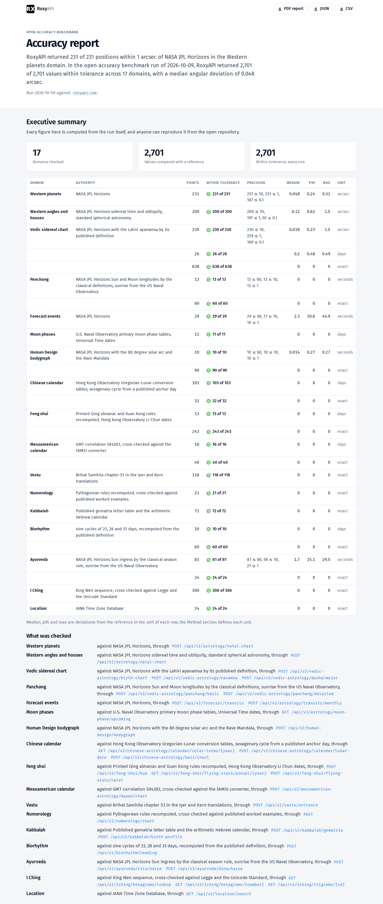
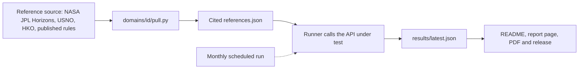

<p align="center">
  <a href="https://roxyapi.com">
    
  </a>
</p>

# Astrology API Accuracy Benchmark

The RoxyAPI Astrology API Accuracy Benchmark is an open, reproducible benchmark that checks the RoxyAPI astrology and insight API domain by domain against named authorities: NASA JPL Horizons for planets, angles and sidereal positions, and published calendar tables and definitions for calendars, time zones and rule based domains. Every reference value in the RoxyAPI benchmark is cited to its source, every pass band states its reason, and the MIT licensed runner points at any astrology API.

<!-- generated:claim:begin python -m benchmark readme, do not edit -->
> **For the Sun, Moon, planets and Chiron, RoxyAPI returned 231 of 231 positions within 0.32 arcsec (0.000089°) of NASA JPL Horizons.** In the open accuracy benchmark run of 2026-10-09, RoxyAPI returned 2,701 of 2,701 values within tolerance across 17 domains, with a median angular deviation of 0.048 arcsec (0.000013°).
>
> By unit: positions median 0.048 arcsec (0.000013°) over 661; instants median 1.6 seconds over 133; calendar counts median 0 days over 179; discrete values 1,728 of 1,728 exact. Target `roxyapi.com`, generated from [`results/latest.json`](results/latest.json).
<!-- generated:claim:end -->

<!-- generated:scorecard:begin python -m benchmark readme, do not edit -->
| Domain | Authority | Values | Within band | Median | p95 | Max | Unit |
|---|---|---:|---:|---:|---:|---:|---|
| [Western planets](#western-planets) | NASA JPL Horizons | 231 | 231 of 231 | 0.048 | 0.24 | 0.32 | arcsec |
| [Western angles and houses](#western-angles-and-houses) | NASA JPL Horizons sidereal time and obliquity, standard spherical astronomy | 200 | 200 of 200 | 0.12 | 0.62 | 1.5 | arcsec |
| [Vedic sidereal chart](#vedic-sidereal-chart) | NASA JPL Horizons with the Lahiri ayanamsa by its published definition | 230 | 230 of 230 | 0.039 | 0.23 | 1.5 | arcsec |
|  |  | 26 | 26 of 26 | 0.2 | 0.48 | 0.49 | days |
|  |  | 638 | 638 of 638 | 0 | 0 | 0 | exact |
| [Panchang](#panchang) | NASA JPL Horizons Sun and Moon longitudes by the classical definitions, sunrise from the US Naval Observatory | 13 | 13 of 13 | 0 | 0 | 0 | seconds |
|  |  | 60 | 60 of 60 | 0 | 0 | 0 | exact |
| [Forecast events](#forecast-events) | NASA JPL Horizons | 29 | 29 of 29 | 2.3 | 30.6 | 44.9 | seconds |
| [Moon phases](#moon-phases) | U.S. Naval Observatory primary moon phase tables, Universal Time dates | 11 | 11 of 11 | 0 | 0 | 0 | days |
| [Human Design bodygraph](#human-design-bodygraph) | NASA JPL Horizons with the 88 degree solar arc and the Rave Mandala | 10 | 10 of 10 | 0.014 | 0.27 | 0.28 | seconds |
|  |  | 90 | 90 of 90 | 0 | 0 | 0 | exact |
| [Chinese calendar](#chinese-calendar) | Hong Kong Observatory Gregorian-Lunar conversion tables, sexagenary cycle from a published anchor day | 103 | 103 of 103 | 0 | 0 | 0 | days |
|  |  | 32 | 32 of 32 | 0 | 0 | 0 | exact |
| [Feng shui](#feng-shui) | Printed Qing almanac and Xuan Kong rules recomputed, Hong Kong Observatory Li Chun dates | 13 | 13 of 13 | 0 | 0 | 0 | days |
|  |  | 243 | 243 of 243 | 0 | 0 | 0 | exact |
| [Mesoamerican calendar](#mesoamerican-calendar) | GMT correlation 584283, cross-checked against the FAMSI converter | 16 | 16 of 16 | 0 | 0 | 0 | days |
|  |  | 40 | 40 of 40 | 0 | 0 | 0 | exact |
| [Vastu](#vastu) | Brihat Samhita chapter 53 in the Iyer and Kern translations | 118 | 118 of 118 | 0 | 0 | 0 | exact |
| [Numerology](#numerology) | Pythagorean rules recomputed, cross-checked against published worked examples | 21 | 21 of 21 | 0 | 0 | 0 | exact |
| [Kabbalah](#kabbalah) | Published gematria letter table and the arithmetic Hebrew calendar | 72 | 72 of 72 | 0 | 0 | 0 | exact |
| [Biorhythm](#biorhythm) | Sine cycles of 23, 28 and 33 days, recomputed from the published definition | 10 | 10 of 10 | 0 | 0 | 0 | days |
|  |  | 60 | 60 of 60 | 0 | 0 | 0 | exact |
| [Ayurveda](#ayurveda) | NASA JPL Horizons Sun ingress by the classical season rule, sunrise from the US Naval Observatory | 81 | 81 of 81 | 1.7 | 25.1 | 29.6 | seconds |
|  |  | 24 | 24 of 24 | 0 | 0 | 0 | exact |
| [I Ching](#i-ching) | King Wen sequence, cross-checked against Legge and the Unicode Standard | 306 | 306 of 306 | 0 | 0 | 0 | exact |
| [Location](#location) | IANA Time Zone Database | 24 | 24 of 24 | 0 | 0 | 0 | exact |
<!-- generated:scorecard:end -->

[](https://roxyapi.github.io/astrology-api-benchmark/)

<!-- generated:coverage:begin python -m benchmark readme, do not edit -->
The RoxyAPI coverage map: each reference authority, the domain it checks and the quantities compared, generated from the references of every domain in the run.

```mermaid
flowchart LR
  d0("Western planets")
  a0["NASA JPL Horizons"]
  a1["NASA JPL Horizons small-body integration"]
  q0_0["Sun, Moon, planets and Chiron"]
  d1("Western angles and houses")
  a2["Spherical astronomy formulas"]
  q1_0["Ascendant, Midheaven and Placidus cusps"]
  d2("Vedic sidereal chart")
  a3["Lahiri ayanamsa, Calendar Reform Committee definition"]
  a4["IERS Conventions 2010, Table 5.3a"]
  a5["Positional Astronomy Centre, Kolkata"]
  a6["Brihat Parasara Hora Sastra"]
  q2_0["Lahiri ayanamsa and sidereal longitudes"]
  q2_1["Nakshatra and pada"]
  q2_2["Navamsa and Vimshottari"]
  d3("Panchang")
  a7["Surya Siddhanta, Burgess translation"]
  a8["US Naval Observatory Astronomical Applications API"]
  q3_0["Tithi, yoga, karana and vara"]
  q3_1["Sunrise"]
  d4("Forecast events")
  a9["US Naval Observatory seasons"]
  q4_0["Sign ingress instants"]
  q4_1["Station instants"]
  q4_2["Exact transit instant"]
  d5("Moon phases")
  a10["U.S. Naval Observatory Astronomical Applications moon phase service"]
  q5_0["Phase dates"]
  d6("Human Design bodygraph")
  a11["Introduction to the Human Design System"]
  a12["Jovian Archive"]
  a13["Human Design Gates by Zodiac Degrees"]
  q6_0["Design instant"]
  q6_1["Personality and design Sun and Earth gates and lines"]
  q6_2["Profile"]
  d7("Chinese calendar")
  a14["Hong Kong Observatory Gregorian-Lunar calendar conversion table"]
  a15["Sexagenary cycle"]
  a16["Ganzhi"]
  q7_0["Solar terms and Lunar New Year"]
  q7_1["Four pillars"]
  d8("Feng shui")
  a17["Xieji Bianfang Shu"]
  a18["Gujin Tushu Jicheng, Yangzhai Shishu"]
  a19["Shen Shi Xuan Kong Xue"]
  q8_0["Kua number and the Li Chun year boundary"]
  q8_1["Annual flying star plate"]
  q8_2["Natal period, mountain and water stars"]
  d9("Mesoamerican calendar")
  a20["GMT correlation definition"]
  a21["FAMSI date converter"]
  q9_0["Long Count and day count"]
  q9_1["Tzolkin sign and number"]
  q9_2["Haab month and day"]
  d10("Vastu")
  a22["Varahamihira, Brihat Samhita, translated by N. Chidambaram Iyer"]
  a23["Kern, Verspreide Geschriften vol. 2"]
  q10_0["Entrance side and pada from facing bearing and door position"]
  q10_1["Square of the nine by nine plan"]
  q10_2["Classical effect of the entrance pada"]
  d11("Numerology")
  a24["Pythagorean numerology rules"]
  a25["Hans Decoz worked examples"]
  q11_0["Life Path, Expression and Soul Urge"]
  d12("Kabbalah")
  a26["Mispar Hechrachi letter table"]
  a27["Dershowitz and Reingold, Calendrical Calculations"]
  a28["Hebcal date converter"]
  q12_0["Mispar Hechrachi and Mispar Gadol word values"]
  q12_1["Hebrew year, month and day, with the leap year flag"]
  d13("Biorhythm")
  a29["Cleve Moler, Biorhythms, MathWorks blog"]
  a30["US Patent 4,240,153, Biorhythm display device, USPTO"]
  q13_0["Physical, emotional and intellectual cycles"]
  d14("Ayurveda")
  a31["Sushruta Samhita, Bhishagratna translation"]
  a32["Charaka Samhita, Sutrasthana 6"]
  a33["Ashtanga Hridaya, Sutrasthana 1.8"]
  q14_0["Season at a date, both zodiacs and both hemispheres"]
  q14_1["Season opening and closing instants"]
  q14_2["Sunrise and sunset"]
  q14_3["Brahma muhurta window"]
  q14_4["Dosha periods of the day and night"]
  d15("I Ching")
  a34["List of hexagrams of the I Ching"]
  a35["The Unicode Standard, trigram and hexagram blocks"]
  a36["Legge, The Yi King, Sacred Books of the East vol. 16"]
  q15_0["King Wen hexagrams and trigrams"]
  d16("Location")
  a37["IANA Time Zone Database"]
  q16_0["Time zone and UTC offset"]
  a0 --> d0
  a1 --> d0
  d0 --> q0_0
  a0 --> d1
  a2 --> d1
  d1 --> q1_0
  a0 --> d2
  a3 --> d2
  a4 --> d2
  a5 --> d2
  a6 --> d2
  d2 --> q2_0
  d2 --> q2_1
  d2 --> q2_2
  a0 --> d3
  a7 --> d3
  a3 --> d3
  a5 --> d3
  a8 --> d3
  d3 --> q3_0
  d3 --> q3_1
  a0 --> d4
  a9 --> d4
  d4 --> q4_0
  d4 --> q4_1
  d4 --> q4_2
  a10 --> d5
  d5 --> q5_0
  a0 --> d6
  a11 --> d6
  a12 --> d6
  a13 --> d6
  d6 --> q6_0
  d6 --> q6_1
  d6 --> q6_2
  a14 --> d7
  a15 --> d7
  a16 --> d7
  d7 --> q7_0
  d7 --> q7_1
  a17 --> d8
  a18 --> d8
  a19 --> d8
  a14 --> d8
  d8 --> q8_0
  d8 --> q8_1
  d8 --> q8_2
  a20 --> d9
  a21 --> d9
  d9 --> q9_0
  d9 --> q9_1
  d9 --> q9_2
  a22 --> d10
  a23 --> d10
  d10 --> q10_0
  d10 --> q10_1
  d10 --> q10_2
  a24 --> d11
  a25 --> d11
  d11 --> q11_0
  a26 --> d12
  a27 --> d12
  a28 --> d12
  d12 --> q12_0
  d12 --> q12_1
  a29 --> d13
  a30 --> d13
  d13 --> q13_0
  a0 --> d14
  a31 --> d14
  a32 --> d14
  a7 --> d14
  a3 --> d14
  a5 --> d14
  a9 --> d14
  a33 --> d14
  a8 --> d14
  d14 --> q14_0
  d14 --> q14_1
  d14 --> q14_2
  d14 --> q14_3
  d14 --> q14_4
  a34 --> d15
  a35 --> d15
  a36 --> d15
  d15 --> q15_0
  a37 --> d16
  d16 --> q16_0
```


<!-- generated:coverage:end -->

**Latest RoxyAPI accuracy report:** [roxyapi.github.io/astrology-api-benchmark](https://roxyapi.github.io/astrology-api-benchmark/) ([PDF](https://roxyapi.github.io/astrology-api-benchmark/report.pdf), [JSON](results/latest.json), [CSV](results/latest.csv))

[](https://roxyapi.github.io/astrology-api-benchmark/)

## What does not count as an accuracy check

- **A wrapper checked against the library it wraps is a self-test.** It shows that arguments pass through, not that the numbers are right.
- **A wrapper checked against NASA JPL Horizons measures the library, not the vendor.** The agreement belongs to the library authors; the vendor added a network hop.
- **The widely used calculation libraries are licensed copyleft or sold under a commercial licence.** A buyer of an API built on one has to ask which licence applies to the product the buyer ships.
- **RoxyAPI reads the NASA JPL DE440 ephemeris directly, verified against NASA JPL Horizons.** No third party calculation library sits between the ephemeris and the response, so the comparison measures RoxyAPI work end to end.
- **A check that omits the bodies, dates or charts where its numbers look worse, or publishes only a median, hides its worst case.** This benchmark publishes every value it measures, Chiron and the 1879 chart included, with the maximum beside the median.
- **Planet positions are one slice of accuracy.** Angles and houses, sidereal frames, calendars, time zones and discrete rules each fail in their own way and need their own authority, so every domain here has its own folder, source and pass band.

## First published here

RoxyAPI published the open Astrology API Accuracy Benchmark first, in April 2026, as the commit history of the repository records. Other astrology API providers have since published accuracy checks of their own, and some have run the RoxyAPI benchmark against their own APIs. An open benchmark is built for exactly that: the method, the references and the runner are public, so anyone can check anyone.

## Getting started

You need a RoxyAPI key, from [roxyapi.com/pricing](https://roxyapi.com/pricing), and uv, which also installs the right Python.

**1. Install uv** ([official instructions](https://docs.astral.sh/uv/getting-started/installation/)).

macOS and Linux:

```bash
curl -LsSf https://astral.sh/uv/install.sh | sh
```

Windows (PowerShell):

```powershell
powershell -ExecutionPolicy ByPass -c "irm https://astral.sh/uv/install.ps1 | iex"
```

**2. Clone and install.**

```bash
git clone https://github.com/RoxyAPI/astrology-api-benchmark.git
cd astrology-api-benchmark
uv sync
```

**3. Add your key** to a file named `.env.local` in the repository root. It is gitignored.

```bash
ROXY_API_KEY=your_key_here
```

**4. Run every domain.** This writes `results/latest.json` and `results/latest.csv`, and exits nonzero when any value fails or is missing.

```bash
uv run python -m benchmark run
```

Add `--domain western-planets` (repeatable) to run one domain.

**5. Build the report page,** then open `dist/index.html` in a browser. It is one self contained file.

```bash
uv run python -m benchmark site
```

**6. Refresh this README** from the new results. The generated blocks are rewritten in place.

```bash
uv run python -m benchmark readme
```

## Run against another API

### One domain at a time

Many astrology APIs cover a single domain and list it as several products: a natal chart, synastry and daily horoscopes sold as three. The RoxyAPI benchmark counts the way the RoxyAPI API reference does, one domain per distinct body of calculation, so those three are one domain here (Western astrology, checked by the Western planets and Western angles folders), and every domain in the coverage map above is a separate one. To test a single-domain provider, run only the folder that matches what it sells:

```bash
uv run python -m benchmark run --domain western-planets
uv run python -m benchmark run --domain western-planets --domain western-angles
```

`--domain` takes a folder name under `domains/` and repeats; without it every domain runs.

### Against another base URL

1. Set that provider key as `ROXY_API_KEY` in `.env.local`; the runner sends it in the `X-API-Key` header. A provider that expects another header needs one line changed in `benchmark/api.py`.
2. Adapt the `check()` function in `domains/{id}/check.py` for each domain you run. It is the one place a response is read, mapping it to the quantity names in `references.json`.
3. Run that domain against the provider and keep its results apart:

```bash
uv run python -m benchmark run --target https://api.example.com/v1 --domain western-planets --out runs/example
```

The references, pass bands and statistics stay exactly as they are, so a single-domain provider is measured by the same numbers as the full RoxyAPI run.

## Method



The runner reads committed references only. The scheduled workflow reruns it every month, rewrites the results and republishes the README, the report page, the PDF and the release.

**Time.** The API receives the local birth time with its UTC offset or IANA zone name, exactly as a user would send it. The reference is computed at the UT instant from standard datetime math. A wrong time zone resolution moves every position, and the Moon, at about 13 degrees a day, shows it first.

**Reference.** Each domain names its authority and commits its reference values with the source, the retrieval date and the licence. Machine sources such as NASA JPL Horizons are pulled by `domains/{id}/pull.py`. Rule based domains are recomputed from a published definition, and a second source is transcribed as cross checks the recomputation must reproduce. The runner reads committed files only and never contacts a reference server.

**A check.** For every case the runner calls the API, reads each quantity and measures the deviation in the unit of that quantity: arcseconds for angles with 0 to 360 wraparound, seconds for instants, days for calendar counts, exact match for discrete values. A value inside its pass band is PASS, outside is FAIL, absent or unreadable is MISSING. Pass bands are vendor neutral floors, never sized to one implementation, so read the largest deviation per quantity for regressions.

**Two choices on the planets.** Jupiter to Pluto are compared with the Horizons system barycentres, which is what a planetary ephemeris integrates, because the Horizons planet centres come from separate satellite solutions that sit thousands of kilometres off it. The residual left on the oldest chart, from 1879, is the reference frame model: Horizons prints longitudes on the IAU 1976 and 1980 precession and nutation model, which drifts from the current IAU 2006 and 2000 model by about 0.3 arcseconds per century away from the year 2000.

**Subjects.** The shared subject corpus is `data/charts.csv`. Named charts carry an AA, A or B Rodden rating from the public [Astro-Databank](https://www.astro.com/astro-databank) record, so anyone can check the birth data. Synthetic charts exercise time zone edge cases on purpose: daylight saving gaps and overlaps, local mean time before standard zones, half hour offsets, high latitudes and a skipped calendar day. Their value is coverage, not provenance.

## Domains

<!-- generated:domains:begin python -m benchmark readme, do not edit -->
### Western planets

**Authority:** NASA JPL Horizons. **Covers:** Sun, Moon, planets and Chiron. **Endpoints:** [`POST /api/v2/astrology/natal-chart`](https://roxyapi.com/api-reference#tag/western-astrology/POST/astrology/natal-chart).

**Pass bands:** Moon 72 arcsec; every other quantity 36 arcsec.

**Per quantity**

| Quantity | Reference | Median | Max | Worst case |
|---|---|---:|---:|---|
| Pluto | NASA JPL Horizons | 0.056 arcsec | 0.32 arcsec | `einstein` |
| Saturn | NASA JPL Horizons | 0.049 arcsec | 0.31 arcsec | `einstein` |
| Neptune | NASA JPL Horizons | 0.048 arcsec | 0.31 arcsec | `einstein` |
| Chiron | NASA JPL Horizons small-body integration | 0.049 arcsec | 0.31 arcsec | `einstein` |
| Uranus | NASA JPL Horizons | 0.048 arcsec | 0.31 arcsec | `einstein` |
| Jupiter | NASA JPL Horizons | 0.048 arcsec | 0.31 arcsec | `einstein` |
| Mars | NASA JPL Horizons | 0.048 arcsec | 0.31 arcsec | `einstein` |
| Sun | NASA JPL Horizons | 0.048 arcsec | 0.31 arcsec | `einstein` |
| Venus | NASA JPL Horizons | 0.048 arcsec | 0.31 arcsec | `einstein` |
| Mercury | NASA JPL Horizons | 0.048 arcsec | 0.3 arcsec | `einstein` |
| Moon | NASA JPL Horizons | 0.048 arcsec | 0.27 arcsec | `einstein` |

Method, sources, pass-band reasons and sample checks: [report](https://roxyapi.github.io/astrology-api-benchmark/#domain-western-planets).

### Western angles and houses

**Authority:** NASA JPL Horizons sidereal time and obliquity, standard spherical astronomy. **Covers:** Ascendant, Midheaven and Placidus cusps. **Endpoints:** [`POST /api/v2/astrology/natal-chart`](https://roxyapi.com/api-reference#tag/western-astrology/POST/astrology/natal-chart).

**Pass bands:** every quantity 36 arcsec.

**Per quantity**

| Quantity | Reference | Median | Max | Worst case |
|---|---|---:|---:|---|
| Ascendant | NASA JPL Horizons sidereal time and obliquity, standard spherical astronomy | 0.1 arcsec | 1.5 arcsec | `anchorage_winter` |
| Cusp 8 | NASA JPL Horizons sidereal time and obliquity, standard spherical astronomy | 0.11 arcsec | 1.1 arcsec | `anchorage_winter` |
| Cusp 2 | NASA JPL Horizons sidereal time and obliquity, standard spherical astronomy | 0.11 arcsec | 1.1 arcsec | `anchorage_winter` |
| Midheaven | NASA JPL Horizons sidereal time and obliquity, standard spherical astronomy | 0.12 arcsec | 0.86 arcsec | `reykjavik_summer` |
| Cusp 5 | NASA JPL Horizons sidereal time and obliquity, standard spherical astronomy | 0.12 arcsec | 0.74 arcsec | `reykjavik_summer` |
| Cusp 11 | NASA JPL Horizons sidereal time and obliquity, standard spherical astronomy | 0.12 arcsec | 0.74 arcsec | `reykjavik_summer` |
| Cusp 9 | NASA JPL Horizons sidereal time and obliquity, standard spherical astronomy | 0.11 arcsec | 0.73 arcsec | `reykjavik_summer` |
| Cusp 3 | NASA JPL Horizons sidereal time and obliquity, standard spherical astronomy | 0.11 arcsec | 0.73 arcsec | `reykjavik_summer` |
| Cusp 12 | NASA JPL Horizons sidereal time and obliquity, standard spherical astronomy | 0.12 arcsec | 0.69 arcsec | `anchorage_winter` |
| Cusp 6 | NASA JPL Horizons sidereal time and obliquity, standard spherical astronomy | 0.12 arcsec | 0.69 arcsec | `anchorage_winter` |

Method, sources, pass-band reasons and sample checks: [report](https://roxyapi.github.io/astrology-api-benchmark/#domain-western-angles).

### Vedic sidereal chart

**Authority:** NASA JPL Horizons with the Lahiri ayanamsa by its published definition. **Covers:** Lahiri ayanamsa and sidereal longitudes; Nakshatra and pada; Navamsa and Vimshottari. **Endpoints:** [`POST /api/v2/vedic-astrology/birth-chart`](https://roxyapi.com/api-reference#tag/vedic-astrology/POST/vedic-astrology/birth-chart), [`POST /api/v2/vedic-astrology/navamsa`](https://roxyapi.com/api-reference#tag/vedic-astrology/POST/vedic-astrology/navamsa), [`POST /api/v2/vedic-astrology/dasha/major`](https://roxyapi.com/api-reference#tag/vedic-astrology/POST/vedic-astrology/dasha/major).

**Pass bands:** Moon 72 arcsec; Sun, Mars, Mercury, Jupiter, Venus, Saturn 36 arcsec; Lagna 36 arcsec; ayanamsa 3 arcsec; dasha balance 1 day; every other quantity exact match.

**Per quantity**

| Quantity | Reference | Median | Max | Worst case |
|---|---|---:|---:|---|
| Lagna | NASA JPL Horizons with the Lahiri ayanamsa by its published definition | 0.084 arcsec | 1.5 arcsec | `anchorage_winter` |
| Saturn | NASA JPL Horizons with the Lahiri ayanamsa by its published definition | 0.04 arcsec | 0.3 arcsec | `einstein` |
| Jupiter | NASA JPL Horizons with the Lahiri ayanamsa by its published definition | 0.039 arcsec | 0.3 arcsec | `einstein` |
| Mars | NASA JPL Horizons with the Lahiri ayanamsa by its published definition | 0.039 arcsec | 0.3 arcsec | `einstein` |
| Sun | NASA JPL Horizons with the Lahiri ayanamsa by its published definition | 0.039 arcsec | 0.3 arcsec | `einstein` |
| Venus | NASA JPL Horizons with the Lahiri ayanamsa by its published definition | 0.04 arcsec | 0.3 arcsec | `einstein` |
| Mercury | NASA JPL Horizons with the Lahiri ayanamsa by its published definition | 0.039 arcsec | 0.29 arcsec | `einstein` |
| Moon | NASA JPL Horizons with the Lahiri ayanamsa by its published definition | 0.04 arcsec | 0.26 arcsec | `einstein` |
| ayanamsa | NASA JPL Horizons with the Lahiri ayanamsa by its published definition | 0.0087 arcsec | 0.0096 arcsec | `greenwich_y2k` |

Method, sources, pass-band reasons and sample checks: [report](https://roxyapi.github.io/astrology-api-benchmark/#domain-vedic).

### Panchang

**Authority:** NASA JPL Horizons Sun and Moon longitudes by the classical definitions, sunrise from the US Naval Observatory. **Covers:** Tithi, yoga, karana and vara; Sunrise. **Endpoints:** [`POST /api/v2/vedic-astrology/panchang/basic`](https://roxyapi.com/api-reference#tag/vedic-astrology/POST/vedic-astrology/panchang/basic), [`POST /api/v2/vedic-astrology/panchang/detailed`](https://roxyapi.com/api-reference#tag/vedic-astrology/POST/vedic-astrology/panchang/detailed).

**Pass bands:** sunrise 90 seconds; every other quantity exact match.

**Per quantity**

| Quantity | Reference | Median | Max | Worst case |
|---|---|---:|---:|---|
| sunrise | US Naval Observatory Astronomical Applications API | 0 seconds | 0 seconds | `mumbai-noon` |

Method, sources, pass-band reasons and sample checks: [report](https://roxyapi.github.io/astrology-api-benchmark/#domain-panchang).

### Forecast events

**Authority:** NASA JPL Horizons. **Covers:** Sign ingress instants; Station instants; Exact transit instant. **Endpoints:** [`POST /api/v2/forecast/transits`](https://roxyapi.com/api-reference#tag/forecast/POST/forecast/transits), [`POST /api/v2/astrology/transits/monthly`](https://roxyapi.com/api-reference#tag/western-astrology/POST/astrology/transits/monthly).

**Pass bands:** Sun ingress, Sun ingress, monthly table, Mercury ingress, Mercury ingress, monthly table, Venus ingress, Venus ingress, monthly table, Mars ingress, Mars ingress, monthly table, Sun transit 60 seconds; Moon ingress, monthly table 60 seconds; Jupiter ingress, Jupiter ingress, monthly table, Uranus ingress, Uranus ingress, monthly table, Neptune ingress, Neptune ingress, monthly table 600 seconds; Mars station, Venus station, Mercury station 60 seconds; Pluto station, Neptune station, Saturn station 600 seconds.

**Per quantity**

| Quantity | Reference | Median | Max | Worst case |
|---|---|---:|---:|---|
| Uranus ingress, monthly table | NASA JPL Horizons | 44.9 seconds | 44.9 seconds | `uranus-enters-gemini-2025-07` |
| Neptune ingress | NASA JPL Horizons | 30.6 seconds | 30.7 seconds | `neptune-enters-aries-2025-03` |
| Sun ingress, monthly table | NASA JPL Horizons | 23.5 seconds | 30.1 seconds | `sun-enters-aries-2025-03` |
| Venus ingress, monthly table | NASA JPL Horizons | 27.9 seconds | 28 seconds | `venus-reenters-pisces-2025-03` |
| Neptune ingress, monthly table | NASA JPL Horizons | 26.6 seconds | 26.7 seconds | `neptune-enters-aries-2025-03` |
| Uranus ingress | NASA JPL Horizons | 25.9 seconds | 25.9 seconds | `uranus-enters-gemini-2025-07` |
| Moon ingress, monthly table | NASA JPL Horizons | 20 seconds | 20.2 seconds | `moon-enters-capricorn-2025-03` |
| Mercury ingress, monthly table | NASA JPL Horizons | 10.8 seconds | 19.6 seconds | `mercury-enters-aries-2025-03` |
| Jupiter ingress, monthly table | NASA JPL Horizons | 15.4 seconds | 15.5 seconds | `jupiter-enters-cancer-2025-06` |
| Pluto station | NASA JPL Horizons | 13.8 seconds | 13.8 seconds | `pluto-stations-retrograde-2025-05` |
| Mars ingress, monthly table | NASA JPL Horizons | 7.7 seconds | 7.8 seconds | `mars-enters-leo-2025-04` |
| Jupiter ingress | NASA JPL Horizons | 5.4 seconds | 5.5 seconds | `jupiter-enters-cancer-2025-06` |
| Mars ingress | NASA JPL Horizons | 2.3 seconds | 2.3 seconds | `mars-enters-leo-2025-04` |
| Venus ingress | NASA JPL Horizons | 1.9 seconds | 2 seconds | `venus-reenters-pisces-2025-03` |
| Mercury ingress | NASA JPL Horizons | 0.78 seconds | 1.1 seconds | `mercury-reenters-pisces-2025-03` |
| Sun ingress | NASA JPL Horizons | 0.95 seconds | 1.1 seconds | `sun-enters-aries-2025-03` |
| Mars station | NASA JPL Horizons | 0.83 seconds | 0.84 seconds | `mars-stations-direct-2025-02` |
| Saturn station | NASA JPL Horizons | 0.72 seconds | 0.72 seconds | `saturn-stations-retrograde-2025-07` |
| Venus station | NASA JPL Horizons | 0.35 seconds | 0.67 seconds | `venus-stations-direct-2025-04` |
| Neptune station | NASA JPL Horizons | 0.62 seconds | 0.62 seconds | `neptune-stations-retrograde-2025-07` |
| Mercury station | NASA JPL Horizons | 0.19 seconds | 0.26 seconds | `mercury-stations-direct-2025-04` |
| Sun transit | NASA JPL Horizons | 0.021 seconds | 0.021 seconds | `sun-opposes-natal-pluto-2025-02` |

Method, sources, pass-band reasons and sample checks: [report](https://roxyapi.github.io/astrology-api-benchmark/#domain-forecast).

### Moon phases

**Authority:** U.S. Naval Observatory primary moon phase tables, Universal Time dates. **Covers:** Phase dates. **Endpoints:** [`GET /api/v2/astrology/moon-phase/upcoming`](https://roxyapi.com/api-reference#tag/western-astrology/GET/astrology/moon-phase/upcoming).

**Pass bands:** every quantity 0 days.

Method, sources, pass-band reasons and sample checks: [report](https://roxyapi.github.io/astrology-api-benchmark/#domain-moon-phases).

### Human Design bodygraph

**Authority:** NASA JPL Horizons with the 88 degree solar arc and the Rave Mandala. **Covers:** Design instant; Personality and design Sun and Earth gates and lines; Profile. **Endpoints:** [`POST /api/v2/human-design/bodygraph`](https://roxyapi.com/api-reference#tag/human-design/POST/human-design/bodygraph).

**Pass bands:** design instant 60 seconds; every other quantity exact match.

**Per quantity**

| Quantity | Reference | Median | Max | Worst case |
|---|---|---:|---:|---|
| design instant | NASA JPL Horizons with the 88 degree solar arc and the Rave Mandala | 0.014 seconds | 0.28 seconds | `obama` |

Method, sources, pass-band reasons and sample checks: [report](https://roxyapi.github.io/astrology-api-benchmark/#domain-human-design).

### Chinese calendar

**Authority:** Hong Kong Observatory Gregorian-Lunar conversion tables, sexagenary cycle from a published anchor day. **Covers:** Solar terms and Lunar New Year; Four pillars. **Endpoints:** [`GET /api/v2/chinese-astrology/calendar/solar-terms/{year}`](https://roxyapi.com/api-reference#tag/chinese-astrology/GET/chinese-astrology/calendar/solar-terms/{year}), [`POST /api/v2/chinese-astrology/calendar/lunar-date`](https://roxyapi.com/api-reference#tag/chinese-astrology/POST/chinese-astrology/calendar/lunar-date), [`POST /api/v2/chinese-astrology/bazi/chart`](https://roxyapi.com/api-reference#tag/chinese-astrology/POST/chinese-astrology/bazi/chart).

**Pass bands:** year_pillar, month_pillar, day_pillar, hour_pillar exact match; every other quantity 0 days.

Method, sources, pass-band reasons and sample checks: [report](https://roxyapi.github.io/astrology-api-benchmark/#domain-chinese-calendar).

### Feng shui

**Authority:** Printed Qing almanac and Xuan Kong rules recomputed, Hong Kong Observatory Li Chun dates. **Covers:** Kua number and the Li Chun year boundary; Annual flying star plate; Natal period, mountain and water stars. **Endpoints:** [`POST /api/v2/feng-shui/kua`](https://roxyapi.com/api-reference#tag/feng-shui/POST/feng-shui/kua), [`GET /api/v2/feng-shui/flying-stars/annual/{year}`](https://roxyapi.com/api-reference#tag/feng-shui/GET/feng-shui/flying-stars/annual/{year}), [`POST /api/v2/feng-shui/flying-stars/natal`](https://roxyapi.com/api-reference#tag/feng-shui/POST/feng-shui/flying-stars/natal).

**Pass bands:** boundary_date, changeover_date 0 days; every other quantity exact match.

Method, sources, pass-band reasons and sample checks: [report](https://roxyapi.github.io/astrology-api-benchmark/#domain-feng-shui).

### Mesoamerican calendar

**Authority:** GMT correlation 584283, cross-checked against the FAMSI converter. **Covers:** Long Count and day count; Tzolkin sign and number; Haab month and day. **Endpoints:** [`POST /api/v2/mesoamerican-astrology/mayan/chart`](https://roxyapi.com/api-reference#tag/mesoamerican-astrology/POST/mesoamerican-astrology/mayan/chart).

**Pass bands:** days_since_epoch, julian_day_number 0 days; every other quantity exact match.

Method, sources, pass-band reasons and sample checks: [report](https://roxyapi.github.io/astrology-api-benchmark/#domain-mesoamerican-calendar).

### Vastu

**Authority:** Brihat Samhita chapter 53 in the Iyer and Kern translations. **Covers:** Entrance side and pada from facing bearing and door position; Square of the nine by nine plan; Classical effect of the entrance pada. **Endpoints:** [`POST /api/v2/vastu/entrance`](https://roxyapi.com/api-reference#tag/vastu/POST/vastu/entrance).

**Pass bands:** every quantity exact match.

Method, sources, pass-band reasons and sample checks: [report](https://roxyapi.github.io/astrology-api-benchmark/#domain-vastu).

### Numerology

**Authority:** Pythagorean rules recomputed, cross-checked against published worked examples. **Covers:** Life Path, Expression and Soul Urge. **Endpoints:** [`POST /api/v2/numerology/chart`](https://roxyapi.com/api-reference#tag/numerology/POST/numerology/chart).

**Pass bands:** every quantity exact match.

Method, sources, pass-band reasons and sample checks: [report](https://roxyapi.github.io/astrology-api-benchmark/#domain-numerology).

### Kabbalah

**Authority:** Published gematria letter table and the arithmetic Hebrew calendar. **Covers:** Mispar Hechrachi and Mispar Gadol word values; Hebrew year, month and day, with the leap year flag. **Endpoints:** [`POST /api/v2/kabbalah/gematria`](https://roxyapi.com/api-reference#tag/kabbalah/POST/kabbalah/gematria), [`POST /api/v2/kabbalah/birth-profile`](https://roxyapi.com/api-reference#tag/kabbalah/POST/kabbalah/birth-profile).

**Pass bands:** every quantity exact match.

Method, sources, pass-band reasons and sample checks: [report](https://roxyapi.github.io/astrology-api-benchmark/#domain-kabbalah).

### Biorhythm

**Authority:** Sine cycles of 23, 28 and 33 days, recomputed from the published definition. **Covers:** Physical, emotional and intellectual cycles. **Endpoints:** [`POST /api/v2/biorhythm/reading`](https://roxyapi.com/api-reference#tag/biorhythm/POST/biorhythm/reading).

**Pass bands:** days_since_birth 0 days; every other quantity exact match.

Method, sources, pass-band reasons and sample checks: [report](https://roxyapi.github.io/astrology-api-benchmark/#domain-biorhythm).

### Ayurveda

**Authority:** NASA JPL Horizons Sun ingress by the classical season rule, sunrise from the US Naval Observatory. **Covers:** Season at a date, both zodiacs and both hemispheres; Season opening and closing instants; Sunrise and sunset; Brahma muhurta window; Dosha periods of the day and night. **Endpoints:** [`POST /api/v2/ayurveda/ritucharya`](https://roxyapi.com/api-reference#tag/ayurveda/POST/ayurveda/ritucharya), [`POST /api/v2/ayurveda/dinacharya`](https://roxyapi.com/api-reference#tag/ayurveda/POST/ayurveda/dinacharya).

**Pass bands:** ritu start, ritu end 60 seconds; sidereal ritu start, sidereal ritu end 120 seconds; sunrise, sunset, next sunrise, brahma muhurta start, brahma muhurta end, day pitta start, day vata start, night pitta start, night vata start 90 seconds; ritu, sidereal ritu, southern ritu, dosha order exact match.

**Per quantity**

| Quantity | Reference | Median | Max | Worst case |
|---|---|---:|---:|---|
| sunset | NASA JPL Horizons Sun ingress by the classical season rule, sunrise from the US Naval Observatory | 27.2 seconds | 29.6 seconds | `quito-equinox` |
| sunrise | NASA JPL Horizons Sun ingress by the classical season rule, sunrise from the US Naval Observatory | 9.3 seconds | 25.1 seconds | `reykjavik-midwinter` |
| brahma muhurta start | NASA JPL Horizons Sun ingress by the classical season rule, sunrise from the US Naval Observatory | 9.3 seconds | 25.1 seconds | `reykjavik-midwinter` |
| brahma muhurta end | NASA JPL Horizons Sun ingress by the classical season rule, sunrise from the US Naval Observatory | 9.3 seconds | 25.1 seconds | `reykjavik-midwinter` |
| day vata start | NASA JPL Horizons Sun ingress by the classical season rule, sunrise from the US Naval Observatory | 16.6 seconds | 23.5 seconds | `sydney-midsummer` |
| next sunrise | NASA JPL Horizons Sun ingress by the classical season rule, sunrise from the US Naval Observatory | 13.3 seconds | 22.2 seconds | `london-midsummer` |
| night pitta start | NASA JPL Horizons Sun ingress by the classical season rule, sunrise from the US Naval Observatory | 13.7 seconds | 20.9 seconds | `reykjavik-midwinter` |
| day pitta start | NASA JPL Horizons Sun ingress by the classical season rule, sunrise from the US Naval Observatory | 7.6 seconds | 19.8 seconds | `sydney-midsummer` |
| night vata start | NASA JPL Horizons Sun ingress by the classical season rule, sunrise from the US Naval Observatory | 5.1 seconds | 14.6 seconds | `reykjavik-midwinter` |
| ritu start | NASA JPL Horizons Sun ingress by the classical season rule, sunrise from the US Naval Observatory | 1.5 seconds | 1.7 seconds | `vasanta-grisma-after` |
| ritu end | NASA JPL Horizons Sun ingress by the classical season rule, sunrise from the US Naval Observatory | 1.6 seconds | 1.7 seconds | `sisira-vasanta-after` |
| sidereal ritu start | NASA JPL Horizons Sun ingress by the classical season rule, sunrise from the US Naval Observatory | 0.71 seconds | 0.97 seconds | `sidereal-sisira-opens-before` |
| sidereal ritu end | NASA JPL Horizons Sun ingress by the classical season rule, sunrise from the US Naval Observatory | 0.42 seconds | 0.85 seconds | `sidereal-sisira-closes-after` |

Method, sources, pass-band reasons and sample checks: [report](https://roxyapi.github.io/astrology-api-benchmark/#domain-ayurveda).

### I Ching

**Authority:** King Wen sequence, cross-checked against Legge and the Unicode Standard. **Covers:** King Wen hexagrams and trigrams. **Endpoints:** [`GET /api/v2/iching/hexagrams/lookup`](https://roxyapi.com/api-reference#tag/i-ching/GET/iching/hexagrams/lookup), [`GET /api/v2/iching/hexagrams/{number}`](https://roxyapi.com/api-reference#tag/i-ching/GET/iching/hexagrams/{number}), [`GET /api/v2/iching/trigrams/{id}`](https://roxyapi.com/api-reference#tag/i-ching/GET/iching/trigrams/{id}).

**Pass bands:** every quantity exact match.

Method, sources, pass-band reasons and sample checks: [report](https://roxyapi.github.io/astrology-api-benchmark/#domain-i-ching).

### Location

**Authority:** IANA Time Zone Database. **Covers:** Time zone and UTC offset. **Endpoints:** [`GET /api/v2/location/search`](https://roxyapi.com/api-reference#tag/location-and-timezone/GET/location/search).

**Pass bands:** every quantity exact match.

Method, sources, pass-band reasons and sample checks: [report](https://roxyapi.github.io/astrology-api-benchmark/#domain-location).
<!-- generated:domains:end -->

## Adding a domain

A domain is a folder under `domains/`. The core never lists domains, so adding one is adding the folder:

- `check.py` exports `DOMAIN` (id, title, authority, endpoints, listing order) and `check(api, refs)`, which calls the API for every case and returns one measurement per value.
- `references.json` holds the sources, the tolerances with their reasons and the cases. The schema refuses an unsourced value, a quantity without a tolerance or a value of the wrong type.
- `pull.py` exports `pull()`, which rebuilds `references.json` from the source: `uv run python -m benchmark pull {id}`.

Run `uv run pytest`, and the domain is checked, reported and credited from the next run on.

## Credits and sources

Generated from the `sources` of every domain in the run.

<!-- generated:credits:begin python -m benchmark readme, do not edit -->
| Source | Licence | Retrieved | Used for |
|---|---|---|---|
| [NASA JPL Horizons](https://ssd.jpl.nasa.gov/api/horizons.api) | NASA JPL data, public domain US government work; cite Horizons | 2026-10-09 | Western planets, Western angles and houses, Vedic sidereal chart, Panchang, Forecast events, Human Design bodygraph, Ayurveda |
| [NASA JPL Horizons small-body integration](https://ssd.jpl.nasa.gov/api/horizons.api) | NASA JPL data, public domain US government work; cite Horizons | 2026-10-09 | Western planets |
| Spherical astronomy formulas. Jean Meeus, Astronomical Algorithms, first edition, Willmann-Bell, 1991: chapter 12 eq. 12.1 to 12.4 and 12.9, chapter 14 eq. 14.1. Placidus de Titis, Tabulae Primi Mobilis, 1657, for the house definition. | Formulas and definitions only; no text reproduced | 2026-10-09 | Western angles and houses |
| [Lahiri ayanamsa, Calendar Reform Committee definition](https://archive.org/details/calendar_reform_comittee_report). Report of the Calendar Reform Committee, Government of India, Council of Scientific and Industrial Research, 1955: Recommendations for the religious calendar, item 7, pages 7 and 8; general precession, page 209 | Government of India publication; the definition is cited, no text is reproduced | 2026-10-09 | Vedic sidereal chart, Panchang, Ayurveda |
| [IERS Conventions 2010, Table 5.3a](https://iers-conventions.obspm.fr/content/chapter5/additional_info/tab5.3a.txt) | IERS Conventions (2010), IERS Technical Note 36; data cited | 2026-10-09 | Vedic sidereal chart |
| [Positional Astronomy Centre, Kolkata](https://packolkata.imd.gov.in/download/nirlon/nlongitude.htm) | Government of India data, India Meteorological Department; values cited with attribution | 2026-10-09 | Vedic sidereal chart, Panchang, Ayurveda |
| [Brihat Parasara Hora Sastra](https://archive.org/details/BPHSEnglish). Brihat Parasara Hora Sastra, translated by R. Santhanam, Ranjan Publications: chapter 6 sloka 12 (volume 1 page 72) for navamsa, chapter 46 slokas 12 to 16 and notes (volume 2 pages 507 to 509) for nakshatra, pada and the Vimshottari dasha at birth | Classical text; the rules are cited, no translation text is reproduced | 2026-10-09 | Vedic sidereal chart |
| [Surya Siddhanta, Burgess translation](https://archive.org/details/jstor-592174). Translation of the Surya-Siddhanta, a Text-Book of Hindu Astronomy, by Ebenezer Burgess, Journal of the American Oriental Society, volume 6, 1860: chapter 2 verses 65 to 69 (pages 235 to 238) for yoga, tithi and karana; chapter 1 verse 13 note (page 151) and verses 51 and 52 (pages 175 and 176) for the day counted from sunrise and named for its lord | Classical text in an openly digitised 1860 translation; the rules are cited, no text is reproduced | 2026-10-09 | Panchang |
| [US Naval Observatory Astronomical Applications API](https://aa.usno.navy.mil/data/api). Complete Sun and Moon Data for One Day; rise and set defined at https://aa.usno.navy.mil/faq/RST_defs | US Government data, public domain; cite USNO | 2026-10-09 | Panchang, Ayurveda |
| [US Naval Observatory seasons](https://aa.usno.navy.mil/data/api) | US Naval Observatory data, public domain US government work | 2026-10-09 | Forecast events, Ayurveda |
| [U.S. Naval Observatory Astronomical Applications moon phase service](https://aa.usno.navy.mil/data/api) | U.S. government work, public domain; cite the Astronomical Applications Department | 2026-10-09 | Moon phases |
| [Introduction to the Human Design System](https://www.ihdschool.com/resources/free-library). Ra Uru Hu, Introduction to the Human Design System, International Human Design School, free edition: pages 3 and 4, the Design calculation 88 degrees of the movement of the Sun before birth | Published by the International Human Design School; the rule is cited, no text is reproduced | 2026-10-09 | Human Design bodygraph |
| [Jovian Archive](https://jovianarchive.com/blogs/transits-global-cycles/the-rave-new-year-stage-1-and-2) | Jovian Archive publication; facts cited, no text reproduced | 2026-10-09 | Human Design bodygraph |
| [Human Design Gates by Zodiac Degrees](https://bonniesorsby.com/human-design-gates-by-degree/) | Published table; the degree of each gate is cited as a fact | 2026-10-09 | Human Design bodygraph |
| [Hong Kong Observatory Gregorian-Lunar calendar conversion table](https://www.hko.gov.hk/en/gts/time/conversion.htm) | Hong Kong Government open data: free to reproduce for commercial and non-commercial use with attribution to the Government and DATA.GOV.HK | 2026-10-09 | Chinese calendar, Feng shui |
| [Sexagenary cycle](https://en.wikipedia.org/wiki/Sexagenary_cycle) | Calendar definition, facts only; the page is CC BY-SA | 2026-10-09 | Chinese calendar |
| [Ganzhi](https://zh.wikipedia.org/wiki/干支) | Calendar definition, facts only; the page is CC BY-SA | 2026-10-09 | Chinese calendar |
| [Xieji Bianfang Shu](https://zh.wikisource.org/wiki/欽定協紀辨方書_(四庫全書本)). Qinding Xieji Bianfang Shu, compiled by Yunlu, Mei Gucheng, He Guozong and others by imperial order, 1739 to 1741, Siku Quanshu edition. Juan 35 (appendix), the section on the nine palaces of men and women: the Kua rule for both sexes. Juan 8, the table of the year star entering the centre and its worked plate for the jiazi year 1684: the annual centre star, the era anchor and the Lo Shu flight path. Juan 34, the note on building works between Da Han and Li Chun: the year spirits change at Li Chun | Public domain text, compiled 1739 to 1741; rules only | 2026-10-09 | Feng shui |
| [Gujin Tushu Jicheng, Yangzhai Shishu](https://zh.wikisource.org/wiki/欽定古今圖書集成/博物彙編/藝術典/第675卷). Qinding Gujin Tushu Jicheng, 1726, Bowu section, Yishu canon, juan 675, Kanyu part 25: Yangzhai Shishu, chapter 2 on the Fu Yuan, the rule for starting men and women in the three eras, and the table of the Fu De palace for every year of the three jiazi eras | Public domain text, printed 1726; values only | 2026-10-09 | Feng shui |
| [Shen Shi Xuan Kong Xue](https://www.diancangwang.cn/xuanxuewushu/f6f37803664b/90b563d9cb41.html). Shen Zhureng, Shen Shi Xuan Kong Xue, edited by Shen Zumian, first edition 1925, revised edition 1933, juan 4: the palm rule for placing stars on the nine palaces and the nine period star table of the 24 mountains; the same juan names 1864 as the year the upper era opened | Public domain text, author died 1906, first printed 1925; rules only | 2026-10-09 | Feng shui |
| [GMT correlation definition](https://en.wikipedia.org/wiki/Mesoamerican_Long_Count_calendar). Fliegel and Van Flandern, A machine algorithm for processing calendar dates, Communications of the ACM 11 (10), 1968, p. 657 | Calendar definition, facts only; the page is CC BY-SA | 2026-10-09 | Mesoamerican calendar |
| [FAMSI date converter](https://research.famsi.org/date_mayaLC.php) | Published tool output, values only | 2026-10-09 | Mesoamerican calendar |
| [Varahamihira, Brihat Samhita, translated by N. Chidambaram Iyer](https://archive.org/details/b29353130). Varahamihira, The Brihat Samhita, translated into English by N. Chidambaram Iyer, Madura, South Indian Press, 1884, chapter 53 (the sixth chapter of the volume part on architecture), verses 42 to 45 for the squares and 71 to 75 for the effects | Public domain translation, Madura, 1884; values only | 2026-10-09 | Vastu |
| [Kern, Verspreide Geschriften vol. 2](https://archive.org/details/in.gov.ignca.10715). Hendrik Kern, translation of the Brhat Sanhita of Varahamihira, in Verspreide Geschriften vol. 2, The Hague, 1913, chapter 53, verses 71 to 75 | Public domain translation, The Hague, 1913; values only | 2026-10-09 | Vastu |
| [Pythagorean numerology rules](https://www.worldnumerology.com/numerology-life-path/) | Published rules, facts only; no text is copied | 2026-10-09 | Numerology |
| [Hans Decoz worked examples](https://www.worldnumerology.com/numerology-expression/) | Published worked examples, results only | 2026-10-09 | Numerology |
| [Mispar Hechrachi letter table](https://en.wikipedia.org/wiki/Gematria) | Letter values, facts only; the page is CC BY-SA | 2026-10-09 | Kabbalah |
| [Dershowitz and Reingold, Calendrical Calculations](https://www.cambridge.org/core/books/calendrical-calculations/B897CA3260110348F1F7D906B8D9480D). Dershowitz and Reingold, Calendrical Calculations, Cambridge University Press, chapter 8 The Hebrew Calendar | Published algorithm, recomputed; no text or code copied | 2026-10-09 | Kabbalah |
| [Hebcal date converter](https://www.hebcal.com/converter) | Published tool output, values only | 2026-10-09 | Kabbalah |
| [Cleve Moler, Biorhythms, MathWorks blog](https://blogs.mathworks.com/cleve/2012/06/11/biorhythms-2/) | Published definition, facts only, cited | 2026-10-09 | Biorhythm |
| [US Patent 4,240,153, Biorhythm display device, USPTO](https://patents.google.com/patent/US4240153A/en) | US government patent record, facts only, cited | 2026-10-09 | Biorhythm |
| [Sushruta Samhita, Bhishagratna translation](https://archive.org/details/india.history.resource.92776). An English Translation of the Sushruta Samhita, Kaviraj Kunja Lal Bhishagratna, Calcutta 1907, volume 1, Sutrasthana chapter VI (pages 43 and 44): the twelve months from Magha in six seasons of two, and thirty muhurtas to the day and night | Classical text in an openly digitised 1907 translation; the rules are cited, no text is reproduced | 2026-10-09 | Ayurveda |
| [Charaka Samhita, Sutrasthana 6](https://archive.org/details/GabrielVanLoonCharakaSamhitaVol1Eng). Charaka Samhita, Handbook on Ayurveda Volume I, edited by Gabriel Van Loon, 2002 to 2003, after P. V. Sharma: Sutrasthana 6.3 and 6.4, the six seasons and the northward course from sisira to grisma against the southward course from varsa to hemanta | Cited for the rule only; no text is reproduced | 2026-10-09 | Ayurveda |
| [Surya Siddhanta, Burgess translation](https://archive.org/details/TranslationOfTheSuryaSiddhanta). Translation of the Surya-Siddhanta, a Text-Book of Hindu Astronomy, by Ebenezer Burgess, Journal of the American Oriental Society, volume 6, 1860: chapter 1 verse 13, a solar month is determined by the entrance of the Sun into a sign of the zodiac | Classical text in an openly digitised 1860 translation; the rule is cited, no text is reproduced | 2026-10-09 | Ayurveda |
| [Ashtanga Hridaya, Sutrasthana 1.8](https://archive.org/details/Ashtanga.Hridaya.of.Vagbhata). Ashtanga Hridaya of Vagbhata, Sanskrit with two commentaries, as digitised: Sutrasthana 1.8, the humours hold the end, the middle and the beginning of the day, the night and digestion; Sutrasthana 2.1, rising in the brahma muhurta | Classical text in an openly digitised edition; the rule is cited, no text is reproduced | 2026-10-09 | Ayurveda |
| [List of hexagrams of the I Ching](https://en.wikipedia.org/wiki/List_of_hexagrams_of_the_I_Ching) | King Wen sequence, facts only; the page is CC BY-SA | 2026-10-09 | I Ching |
| [The Unicode Standard, trigram and hexagram blocks](https://www.unicode.org/charts/PDF/U4DC0.pdf) | Unicode character names and order, public specification | 2026-10-09 | I Ching |
| [Legge, The Yi King, Sacred Books of the East vol. 16](https://archive.org/details/mlbd.sacredbooksofeas0000fmax.vol.16). James Legge, The Yi King, Sacred Books of the East vol. 16, Oxford, 1899, Appendix II and Appendix V | Public domain translation, Oxford, 1899; values only | 2026-10-09 | I Ching |
| [IANA Time Zone Database](https://www.iana.org/time-zones) | Public domain | 2026-10-09 | Location |
<!-- generated:credits:end -->

## Citing

Cite this benchmark with the metadata in [CITATION.cff](CITATION.cff). GitHub shows it under "Cite this repository".

## How this fits with RoxyAPI

This repository is the open companion to the [methodology](https://roxyapi.com/methodology) page. RoxyAPI covers Western and Vedic astrology, forecasts, human design, Chinese astrology, numerology, tarot and more behind one API key, with Remote MCP, typed SDKs and drop in UI components. Try the [API reference](https://roxyapi.com/api-reference) or see [pricing](https://roxyapi.com/pricing).

## Licence

[MIT](LICENSE) for the code. Reference values are facts from the sources credited above, each under the licence listed beside it.
